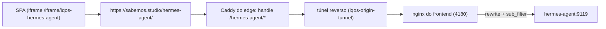

# IQ OS

**IQ OS** é a plataforma de inteligência financeira: contratos públicos, empresas, mercados,
previsões e chat com três modelos de linguagem — GPT-2, Mistral e um **BloombergGPT-style (RAG)** —
treinados sobre dados do Yahoo Finance, acessíveis via API FastAPI e interface React com ambiente
de trabalho em janelas (estilo macOS). O backend permite escolher o modelo em cada pedido (`gpt2`,
`mistral` ou `bloomberg`). O modelo BloombergGPT-style lê documentos PDF convertidos para Markdown
e responde com base no conhecimento indexado.

> **Nota sobre nomes:** a marca visível na aplicação é **IQ OS**. Os identificadores técnicos
> mantêm o nome antigo por compatibilidade — a pasta `finance-llm/`, os comandos `finance-llm.cmd` /
> `finance-llm.ps1`, os índices do Elasticsearch (`finance_*`), as chaves do `localStorage`
> (`finance-llm-*`) e o ficheiro de configuração do CLI (`~/.finance-llm/config.json`).

> **Arquitetura completa do RAG:** ver [`docs/bloomberggpt_rag_architecture.md`](docs/bloomberggpt_rag_architecture.md).

## Estrutura

```
finance-llm/
├── api/                 # Backend FastAPI + agente financeiro + RAG
│   ├── main.py          # Entrypoint FastAPI
│   ├── rag_routes.py    # Endpoints RAG
│   ├── rag_service.py   # Serviço RAG singleton + cache de modelos
│   ├── ontology_registry.py  # Ontologia (tipos de objeto, ligações, ações)
│   ├── ontology_service.py   # Motor da ontologia (consulta, ligações, grounding, validação)
│   ├── ontology_routes.py    # Endpoints /ontology/*
│   └── agent.py         # Agente financeiro (GPT-2 / Mistral / ARIMA)
├── chat-ui/             # Frontend React + Vite + Tailwind CSS v4
│   ├── src/
│   │   ├── pages/RagPage.tsx
│   │   ├── components/RagChat.tsx
│   │   └── components/PdfUploader.tsx
│   └── dist/            # Build de produção
├── collectors/          # Recolha de dados (Yahoo Finance, FRED, ECB, ...)
├── forecasting/         # Previsão ARIMA de séries temporais financeiras
│   ├── arima_model.py
│   └── run_forecast.py
├── rag/                 # Motor RAG (PDF → Markdown → chunks → FAISS)
│   ├── chat/rag_engine.py
│   ├── ingestion/chunker.py
│   ├── ingestion/ingest_pdf.py
│   ├── ingestion/markdown_store.py
│   └── ingestion/vector_store.py
├── processing/          # Normalização e construção do corpus
├── model/               # GPT-2, Mistral e BloombergGPT-style financeiros
│   ├── gpt2_finance.py
│   ├── mistral_finance.py
│   ├── bloomberg_gpt.py
│   ├── gpt2-finance/
│   ├── mistral-finance/
│   └── bloomberg-finance/
├── training/            # Fine-tuning manual em PyTorch
│   ├── train.py
│   └── train_mistral.py
├── inference/           # Geração de texto
│   ├── generate.py
│   └── generate_mistral.py
└── data/                # Dados brutos, processados e finais
```

## Requisitos

- Python 3.11+
- uv (ou `pip` com `.venv`)
- Node.js 20+ (para o UI)

## Instalação

```bash
# Ambiente Python
uv venv --python 3.11 .venv
.venv\Scripts\pip install -r requirements.txt
.venv\Scripts\pip install markitdown[pdf]

# Frontend
cd chat-ui
npm install
```

### Arranque rápido

Após a instalação, usa os scripts helper para iniciar tudo:

```powershell
# Backend + frontend (ports 8003 / 4180)
.\start_solution.ps1
```

Ou em passos separados:

```bash
# Backend na porta 8003 (evita processos fantasmas na 8002)
start_backend_8003.bat

# Frontend (build de produção + preview na porta 4173)
cd chat-ui
npm run build
npm run preview
```

Abre http://127.0.0.1:4180 no browser.

Para parar a solução completa:

```powershell
.\stop_solution.ps1
```

### Docker Compose

Para correr a solução completa (Elasticsearch + backend + frontend) em containers, garante que tens Docker Desktop/Engine instalado e corre:

```bash
docker compose up --build -d
```

- Frontend: http://127.0.0.1:4180
- API docs (Swagger): http://127.0.0.1:8003/docs
- Elasticsearch: http://127.0.0.1:9200
- SearXNG (página iframe «Pesquisa»): http://127.0.0.1:8888
- n8n (página iframe «n8n»): http://127.0.0.1:8891 · direto em http://127.0.0.1:5678
- MiroFish (página iframe «MiroFish», perfil `mirofish`): http://127.0.0.1:8893

Para parar:

```bash
docker compose down
```

Os volumes `./data`, `./model`, `./rag` e `./logs` são montados no backend (os mesmos dados da execução local), e o índice do Elasticsearch persiste no volume `es-data`. Mais detalhes em [`docs/docker-setup.md`](docs/docker-setup.md).

Serviços opcionais (perfis do compose):

```bash
docker compose --profile agents up -d        # Hermes Agent (API :8642 + dashboard na página iframe «Hermes Agent»)
docker compose --profile mirofish up -d      # MiroFish (página iframe «MiroFish», :8893 — precisa de chaves LLM + Zep)
docker compose --profile tools up -d mcp     # servidor MCP em HTTP (http://127.0.0.1:8765/mcp)
docker compose --profile test run --rm tests # pytest + smoke test de todos os endpoints, em Docker
```

Quatro aplicações de apoio ficam pré-instaladas como **páginas iframe** na plataforma (dock → Pesquisa, n8n, Hermes Agent, MiroFish). O dashboard do Hermes entra com **as mesmas contas do IQ OS** — e, no domínio público, com **single sign-on** (sessão do IQ OS → sessão do dashboard, sem segundo formulário): ver [Dashboard do Hermes Agent](#dashboard-do-hermes-agent-subcaminho-público-e-single-sign-on). O MiroFish é uma imagem própria derivada da oficial (`docker/mirofish/Dockerfile`).

## Recolha de dados

```bash
.venv\Scripts\python collectors/yahoo.py
```

## Previsão de séries temporais (ARIMA)

O projecto inclui um módulo de previsão de preços baseado em ARIMA, acessível pela linha de comandos ou através do agente de chat. O modelo segue quatro passos rigorosos:

1. **Estabilização** — preços de fecho transformados em log-retornos.
2. **Validação temporal** — divisão cronológica 85 % treino / 15 % teste, sem baralhamento.
3. **Métricas** — RMSE e MAPE calculados no conjunto de teste.
4. **Análise de resíduos** — teste Ljung-Box para verificar se os resíduos são ruído branco.

### Linha de comandos

Previsão por defeito para a Apple (AAPL) a 5 dias úteis:

```bash
.venv\Scripts\python -m forecasting.run_forecast
```

Definir outro ticker e horizonte:

```bash
.venv\Scripts\python forecasting/arima_model.py --ticker MSFT --future_days 10 --period 5y
```

A saída inclui preços projectados, RMSE, MAPE e p-value de Ljung-Box.

### Pelo agente de chat

Basta perguntar ao chat, por exemplo:

> *Qual a previsão para a Apple nos próximos 5 dias?*

O agente detecta automaticamente perguntas de previsão, extrai o ticker e responde com os valores projectados pelos modelos ARIMA(2,1,2). Enquanto os modelos de linguagem (GPT-2/Mistral) estiverem em treino, a resposta é baseada nos dados do Yahoo Finance e nas métricas de erro do modelo ARIMA.

## Construir corpus e inicializar modelos

```bash
.venv\Scripts\python processing/build_corpus.py
.venv\Scripts\python model/gpt2_finance.py
.venv\Scripts\python model/mistral_finance.py
```

## Treinar

### GPT-2

```bash
.venv\Scripts\python training/train.py
```

### Mistral

```bash
.venv\Scripts\python training/train_mistral.py
```

Por defeito os treinos usam todo o corpus (`8070` exemplos de treino), o que pode demorar várias horas em CPU. Para testes rápidos:

```bash
# GPT-2
.venv\Scripts\python -c "from training.train import train_model; train_model(max_samples=500, save_checkpoints=False)"

# Mistral
.venv\Scripts\python training/train_mistral.py --max_samples 500 --epochs 2 --batch_size 4
```

## Executar

### Backend

Terminal 1 — backend FastAPI na porta **8003** (a 8002 ficou reservada a processos fantasmas no Windows):

```bash
cd finance-llm
start_backend_8003.bat
```

ou manualmente:

```bash
cd finance-llm
.venv\Scripts\python -m uvicorn api.main:app --host 127.0.0.1 --port 8003
```

### Frontend

Terminal 2 — frontend Vite preview na porta **4173**:

```bash
cd finance-llm/chat-ui
npm run build
npm run preview
```

Abre http://127.0.0.1:4173 no browser.

Também pode servir o *build* com o servidor estático do repositório (é o que serve a PWA com os
tipos MIME certos para `manifest.webmanifest`/`sw.js`, em <http://localhost:5174>):

```bash
python _serve_spa.py --root chat-ui/dist --port 5174
```

A instalação da aplicação e o modo offline só funcionam em `localhost` ou HTTPS (contexto seguro).

Endereços da interface (ex.: `/tickers/EDP/grafico`, `/companies/503140600`, `/browser`) podem ser
abertos diretamente: a API serve o `index.html` para **navegações de browser** (`Accept: text/html`)
que não correspondam a um endpoint, e continua a devolver JSON/404 para os pedidos de API e para
caminhos com extensão de ficheiro. Em desenvolvimento com o servidor do Vite, o proxy interno
encaminha `/tickers`, `/companies`, `/contracts`, … para a API — sem este fallback, recarregar a
página numa dessas rotas devolvia `{"detail":"Not Found"}`.

> Nota: a API está configurada para `http://127.0.0.1:8003` em `chat-ui/src/api.ts`. Se alterares a porta, atualiza também o frontend e reconstrói o UI.

### Interface

- **Dock estilo macOS** (em baixo, à esquerda ou à direita) com ampliação ao passar o rato, etiquetas,
  indicadores de aplicações abertas, arrumação por arrastar, material de vidro (ver *Material de
  vidro*) e painel de preferências — incluindo as **miniaturas das janelas minimizadas**. Com o
  aspeto **Windows 11** o mesmo dock passa a **barra de tarefas** (Mica, botões de 40 px, indicador
  por baixo do ícone, Iniciar e relógio) — ver *Aspeto das janelas: macOS ou Windows 11*.
- **Barra lateral = menu de aplicações** (estilo macOS) em três modos — *expandida*, *só ícones*
  (rail de 68 px) e *escondida* — com material translúcido («vibrancy»), pesquisa rápida
  (`/` ou `Ctrl+K`), secção de recentes, secções *Aplicações* / *Ferramentas* com triângulo de
  divulgação e ponto nas aplicações com janela aberta. Cada linha abre (ou foca) a aplicação;
  a **largura é redimensionável** arrastando a divisória (`196`–`384` px, duplo clique repõe `268` px).
  `Ctrl+B` esconde/mostra. As páginas internas de cada aplicação vivem dentro da própria
  aplicação — por exemplo, o EmpresasIQ usa **separadores (segmented control) no topo**, em vez de
  uma barra lateral própria, e nenhuma janela duplica a barra da plataforma.
- **Ecrã inteiro** e **PWA** (instalável, funciona sem ligação): `manifest.webmanifest` + `sw.js`;
  a instalação (e o pacote de atalhos para Windows) está em **Definições → Aplicação IQ OS**.
- **Contas** em Elasticsearch (`finance_users` / `finance_sessions`), com login, registo,
  definições de perfil, sessões ativas e terminação remota.
- **Terminal** (`/cli`) — o CLI da plataforma dentro da aplicação, com histórico (↑/↓),
  completamento com Tab, sugestões clicáveis e saída `--json`.
- **Finder** (`/finder`) — explorador dos dados no estilo do Finder do macOS (locais, ícones,
  colunas, lista, galeria, Quick Look, inspetor, etiquetas, barra de caminho e exportação CSV).
- **Comparação** (`/compare`) — janela própria para pôr lado a lado entidades
  (adjudicantes/adjudicatários) ou contratos, com valores, analítica por ano e CPV em comum.
- **Gráfico Tempo Real** (`/chart`, `/tickers/<T>/grafico`) — cotações em tempo real com o
  *Advanced Real-Time Chart* da TradingView (ver abaixo).
- **Ontologia** (`/ontology`) — a camada semântica: tipos de objeto, propriedades, ligações,
  ações, explorador de objetos e o painel de IA que mostra (e valida) o grounding das respostas.
- **Pesquisa 360** (`/search360`) — meta-modelo de analítica e exploração: federa a plataforma
  com a Wikipédia, Wikidata, dados abertos, investigação e web, e organiza tudo em busca
  federada, dossiê com citações, grafo de exploração e biblioteca de pastas/ficheiros (ver abaixo).
- **Hermes** (`/hermes`) — o assistente de investigação: uma pergunta em linguagem natural, o plano
  (tema, entidades, tickers, NIF), as evidências citadas `[n]` da plataforma e das fontes abertas, e
  uma resposta com dados, indicadores, lacunas e próximos passos (ver abaixo).
- **Office IQ OS** (`/office`) — leitura e escrita de conteúdos em **Markdown** (notas, relatórios,
  atas, páginas e os dossiês da Pesquisa 360), com pastas, pesquisa, duplicação, exportação
  `.md`/`.html` e leitura com tipografia própria (ver abaixo).
- **Email** (`/email`) — a caixa de correio dentro da plataforma: contas **Gmail**, **Outlook/Microsoft
  365**, **iCloud**, **Yahoo**, **Zoho**, **SAPO** ou qualquer servidor **IMAP/SMTP**, com pastas,
  lista de mensagens, leitura, sinalizadores, anexos, envio e resposta (ver abaixo).
- **Browser** (`/browser`) — navegador dentro da plataforma: separadores, favoritos, histórico,
  atalhos para páginas do IQ OS e fontes de mercado e integração com a pesquisa global (ver abaixo).
- **Administração** (`/admin`) — sistema, utilizadores, eventos e logs; visível apenas a contas
  com papel `admin` (ver abaixo).

### Administração da solução

Aplicação **Administração** (`/admin`), reservada a contas com papel `admin` (a barra lateral e o
dock escondem-na aos restantes), com quatro separadores:

- **Visão geral** — versão da API, *host*, plataforma, Python, tempo de atividade, estado do
  Elasticsearch (versão, *cluster*, saúde, nós), **índices** com nº de documentos e tamanho
  (`finance_users`, `finance_sessions`, `finance_events`, `contratos`, `finance_entities`, …),
  contas por papel/estado, sessões ativas e eventos das últimas 24 h por nível, origem e caminho.
- **Utilizadores** — pesquisa por nome/email, filtros por papel (`admin`/`member`) e estado
  (`active`/`suspended`), sessões ativas e nº de logins por conta; alterar papel/estado, terminar
  sessões de um utilizador e apagar contas (as ações ficam registadas como eventos de auditoria).
- **Eventos** — o *event logger viewer* descrito abaixo.
- **Ficheiros de log** — lista de `logs/*.log|.err|.out|.jsonl` com tamanho e data, pré-visualização
  das últimas linhas (100–3000), modo «Direto» (atualiza a cada 5 s) e quebra de linhas.

#### Registo de eventos (event logger)

`api/events_service.py` escreve cada evento em **três destinos** complementares:

1. **Memória** — `deque` circular das últimas 2000 entradas, sempre disponível (é a fonte do modo
   «tempo real», onde aparecem *todos* os pedidos, incluindo os de nível `debug`/`info`);
2. **Ficheiro** — `logs/events.jsonl` (uma linha JSON por evento, com rotação a ~5 MB);
3. **Elasticsearch** — índice `finance_events`, pesquisável e agregável (só recebe
   autenticação/administração e nível ≥ `warning`, para não duplicar o tráfego).

- Um *middleware* em `api/main.py` regista cada pedido à API (método, caminho, status, duração,
  utilizador e IP), com o nível derivado do código de resposta (2xx → `debug`, 4xx → `warning`,
  5xx → `error`); a identidade vem do token (com cache de 5 min para não bater no Elasticsearch).
- `auth_routes.py` regista ainda os eventos de segurança: registo, início de sessão (sucesso e
  falha), fim de sessão, alteração de palavra-passe, revogação de sessões e apagamento de conta.
- O visualizador permite filtrar por **nível** (chips), **origem** (`api`, `auth`, `admin`),
  **utilizador**, **texto** e **janela temporal**, alternar entre **tempo real (memória)** e
  **arquivo (Elasticsearch)** (ou fonte automática), ligar o **modo direto**, ver as contagens por
  nível/origem/caminho e por hora, abrir o JSON completo de cada evento e **registar eventos
  manuais** para teste (`POST /admin/events`).
- Para dar acesso a uma conta (a primeira conta do sistema é `admin`):
  `python scripts/promote_admin.py --email alguem@exemplo.pt` (ou `--list`, `--demote`).

#### Registo da API sem ruído

O terminal da API (uvicorn) enchia-se com dois tipos de mensagens que **não** indicam problemas — e
que escondiam as mensagens úteis. O `api/main.py` aplica agora dois filtros (no arranque do módulo,
validados com o servidor real):

- **404 esperados da navegação pelo proxy** — quando o Browser lê uma página externa pelo proxy, os
  recursos com **caminho absoluto** desse site (por exemplo `/assets/_app/immutable/…` de um site
  SvelteKit) são pedidos à nossa origem e aqui não existem: são 404 normais (a página já foi servida
  pelo proxy). O filtro `_AccessLogFilter`, ligado ao `uvicorn.access`, cala as linhas cujo caminho
  contém `/assets/_app/` ou `/_app/immutable/`. Todos os outros pedidos continuam registados.
- **`ConnectionResetError` (`WinError 10054`)** — quando um browser fecha a ligação a meio, o
  `asyncio` do Windows imprime um `Traceback` de
  `_ProactorBasePipeTransport._call_connection_lost` que **não** é um erro da aplicação. O filtro
  `_AsyncioLogFilter`, ligado ao registo `asyncio`, descarta os registos cujo `exc_info` seja
  `ConnectionResetError`, `ConnectionAbortedError` ou `BrokenPipeError`; exceções reais continuam a
  ser impressas.

O nível de registo **não** mudou (continua a ser o do uvicorn/`INFO`) — os dois filtros são
cirúrgicos, para não esconder erros verdadeiros.

### Material de vidro (glass) e animações

O dock, as janelas e os painéis flutuantes partilham **um material de vidro**: fundo translúcido,
`backdrop-filter` com desfoco e saturação, realce especular no bordo superior e sombra profunda.
Os valores vivem em **variáveis CSS** (`--glass-blur`, `--glass-saturate`, `--glass-window-alpha`,
`--glass-body-alpha`, `--glass-dock-alpha`, `--glass-border`, `--glass-highlight`), escritas por
`applyGlass()` (`chat-ui/src/layout.ts`) a partir das preferências — nenhum componente repete
`backdrop-filter`.

Em **Preferências do dock → Vidro** (secção própria):

- **Efeito de vidro** (`glass.enabled`, ligado por omissão) — desligado fica tudo opaco e sem
  desfoco (`html[data-glass="off"]`), para ecrãs ou GPUs fracas.
- **Intensidade do vidro** (`glass.strength`, 0–100 %): 0 = desfoco alto e superfícies muito
  transparentes; 100 = desfoco de 38 px e superfícies quase opacas (legibilidade máxima).
- **Papel de parede do desktop** (`glass.wallpaper`): manchas de cor (teal/azul/violeta/ciano) no
  «desktop» que deslizam lentamente — é o que o vidro desfoca. A camada anima com `transform`
  (composto no GPU) e não com `background-position`, para não repintar o ecrã inteiro.

As preferências ficam em `localStorage` (`finance-llm-glass:v1`) e são aplicadas em `<html>`
(`data-glass`, `data-wallpaper`), pelo que valem para todo o IQ OS. Com
`prefers-reduced-motion` (ou a preferência de conta «reduzir animações») o papel de parede para e as
transições das janelas/dock são desligadas.

**Animações do dock e das janelas** (todas curtas, ≤ 320 ms):

| Momento | Animação |
| --- | --- |
| Abrir / restaurar janela | `window-appear` (pop com ligeira elasticidade, 320 ms) |
| Fechar janela | `window-close` (encolhe e desvanece, 200 ms) antes de remover |
| Minimizar | `window-minimize` (encolhe para o lado do dock, 280 ms) + miniatura `dock-mini-in` |
| Maximizar / repor / encaixar | geometria com `cubic-bezier(0.22, 1, 0.36, 1)` a 260 ms |
| Arrastar janela | a sombra cresce (a janela «levanta-se»); geometria sem transição |
| Arrastar com 3D ligado | a janela inclina-se até `tilt` graus e endireita ao largar |
| Foco da janela | `box-shadow`/borda/opacidade, 200–220 ms |
| Passar o rato no dock | ampliação por frame + realce do ícone; pressionar |
| Papel de parede | `wallpaper-drift`, 64 s em alternativa (só `transform`) |

> Nota de manutenção: **não duplicar `backdrop-filter` com `-webkit-backdrop-filter`**. O
> compilador de CSS (Lightning CSS, via rolldown-vite) mantinha apenas a versão prefixada e todas as
> superfícies de vidro ficavam sem desfoco. Basta a propriedade padrão — as prefixações necessárias
> são acrescentadas no `build`.

### Janelas 3D

Efeito 3D **opcional** para as janelas, em **Preferências do dock → Janelas 3D**
(`chat-ui/src/layout.ts`, `finance-llm-window3d:v1`):

- **Efeito 3D** (`window3d.enabled`, ligado por omissão) — liga a inclinação e a profundidade.
- **Inclinação ao arrastar** (`window3d.tilt`, 0–8°, predefinição 5°): ao arrastar, a janela
  inclina-se na direção do movimento (como um cartão a ser empurrado); a velocidade é suavizada
  e a janela **endireita** ao largar. Durante o arrasto a inclinação segue o ponteiro (90 ms) e,
  fora dele, a transição é de 260 ms com `cubic-bezier(0.22, 1, 0.36, 1)`.
- **Profundidade** (`window3d.depth`, ligada por omissão): a janela em foco fica à frente e as
  outras recuam (`scale(0.982)`, opacidade 96,5 % e sombra mais curta), dando profundidade.

Como funciona: o `transform` completo é **composto em JS** (`Window.tsx`) —
`perspective(...) translate3d(...) rotateX(..) rotateY(..) scale(..)`. A perspetiva vai dentro do
próprio `transform` (função `perspective()`), pelo que o efeito **não** depende de
`transform-style: preserve-3d` dos antepassados (que o `backdrop-filter` do vidro anularia) e não
colide com o `translate3d` que o arrasto escreve a cada frame. Os tokens no `<html>` são
`--win3d-tilt`, `--win3d-perspective` (1000 + tilt×80 px), `--win3d-depth-scale` e
`--win3d-depth-shadow`; `data-window3d`/`data-window3d-depth` ligam e desligam. Desligado, o
`transform` fica só com `translate3d` (comportamento anterior).

> Robustez do arrasto: `setPointerCapture` pode lançar (por exemplo se o ponteiro já foi
> libertado). O gesto passa a começar **antes** da captura e esta é feita dentro de `try/catch` —
> antes, uma falha na captura deixava o arrasto por fazer.

### Janelas (estilo macOS)

> O **chrome** das janelas pode ser macOS (por omissão) ou **Windows 11** — ver
> *Aspeto das janelas: macOS ou Windows 11* no fim desta secção.

Com o **modo janelas** ligado (predefinição em ecrãs ≥ 1024 px), cada página abre numa janela
flutuante dentro de uma área de trabalho, em vez de ocupar o ecrã inteiro:

- **Arrastar** pela barra de título; **redimensionar** pelas 8 margens.
- **Encaixe**: arrastar para o topo maximiza; para as margens esquerda/direita ocupa meio ecrã
  (com pré-visualização antes de largar).
- **Duplo clique** na barra de título maximiza/reposiciona; arrastar uma janela maximizada
  repõe o tamanho anterior.
- **Semáforos** macOS: fechar, minimizar, maximizar. As janelas minimizadas continuam
  indicadas no dock (ponto) e voltam com um clique no ícone.
- **Minimizar para o dock** (como no macOS): o semáforo amarelo encolhe a janela na direção do
  dock (animação `window-minimize`, 280 ms) e a janela passa a aparecer no dock como
  **miniatura** — uma pequena janela com os três pontos, o ícone e o gradiente da aplicação,
  com etiqueta ao passar o rato. Clicar restaura (a janela volta a crescer com a animação
  `window-appear`) e o botão direito abre *Restaurar janela*, *Maximizar* e *Fechar janela*.
  A barra de menus mostra `N janelas · M no dock`.
  As miniaturas podem desligar-se em **Preferências do dock → Janelas minimizadas no dock**
  (`minimizedShelf`, ligado por omissão); o cálculo do espaço do dock conta com elas.
- **Barra de menus** com o número de janelas, o título da janela ativa, o menu **Janelas**
  (lista todas, incluindo minimizadas, para focar/restaurar) e a disposição
  (`Cascata`, `Lado a lado`, `Minimizar todas`, `Fechar todas`) e relógio.
- **Atalhos**: `Ctrl/Cmd + \`` cicla janelas, `Ctrl/Cmd + W` fecha, `Ctrl/Cmd + M` minimiza,
  `Ctrl/Cmd + Shift + M` maximiza/reposiciona.
- **Área de trabalho vazia** tem um lançador rápido (EmpresasIQ, Contratos, Dashboard, Terminal).

#### Janelas maximizadas, ecrã inteiro e redimensionar

A geometria das janelas é medida a partir da **área de trabalho** (o retângulo abaixo da barra de
menus, já sem a reserva do dock quando ele está visível) e, sempre que essa área muda de tamanho,
`clampWindows()` (`chat-ui/src/windows.ts`) volta a ajustar todas as janelas:

- uma janela **maximizada acompanha o ecrã** — ao entrar/sair do **ecrã inteiro**
  (`chat-ui/src/fullscreen.ts`, `documentElement.requestFullscreen`) ou ao redimensionar a janela
  do browser, passa a ocupar exatamente a nova área de trabalho (antes ficava com o tamanho antigo
  e sobrava moldura à volta, ou faltava espaço) e mantém `data-maximized="true"`, para conservar os
  cantos a 0 px e a ausência de sombra do aspeto Windows 11;
- as restantes janelas são limitadas à área (mínimo de **96 px** da barra de título sempre à vista)
  e deixam de estar maximizadas se tiverem de encolher;
- ao **repor** uma janela maximizada depois de o ecrã ter mudado de tamanho, a geometria anterior é
  limitada ao ecrã atual, para a janela não reaparecer fora da área de trabalho;
- a área de trabalho nunca desliza (nem com `scrollIntoView` de um campo dentro de uma janela).

#### Aspeto das janelas: macOS ou Windows 11

Em **Preferências do dock → Janelas → Aspeto do IQ OS (janelas, dock e barra lateral)** escolhe-se
como o IQ OS se desenha (preferência local `finance-llm-window-style:v1`, aplicada como
`data-window-style` no `<html>`; `chat-ui/src/layout.ts` → `useWindowStyle()`). A escolha aplica-se
às **janelas**, ao **dock** e à **barra lateral**; o **comportamento é exatamente o mesmo** —
arrastar, encaixe, minimizar para o dock, miniaturas, efeito 3D e material — só muda a moldura:

| | macOS (por omissão) | Windows 11 |
| --- | --- | --- |
| Barra de título | 36 px, **semáforos à esquerda**, título **centrado** | 32 px, **ícone e título à esquerda**, controlos **à direita** |
| Controlos | círculos coloridos (fechar/minimizar/maximizar) | 46×32 px encostados ao canto: **–**, **□**/**❐** (restaurar) e **✕**, com `hover` claro e o fechar em `#c42b1c` |
| Cantos | 16 px | **8 px** (0 px quando maximizada) |
| Material | vidro (translúcido, muito desfocado, reflexo especular) | **Mica** (mais opaco, desfoco ≤ 18 px) |
| Sombra | profunda e sempre presente | mais discreta e **desaparece com a janela maximizada** |
| **Dock** | tabuleiro flutuante com cantos de 26 px, vidro, ampliação à la macOS e **miniaturas** das janelas minimizadas | **barra de tarefas** encostada à margem, plana (Mica), **botões de 40 px que crescem até 72 px quando sobra espaço** (o ícone e a espessura da barra acompanham), **indicador por baixo do ícone** (barra de 16 px com foco, 7 px só aberta), botão **Iniciar** (abre o menu Iniciar) e **bandeja com a hora e a data** |
| Miniaturas minimizadas | mini-janela com os três pontos, o ícone e o gradiente | **botões da barra** (quadrados, só o ícone); clicar restaura na mesma |
| **Barra lateral** | vidro tipo «vibrancy» (gradiente translúcido, `blur(30px) saturate(180%)`), topo de 44 px, linhas de 28 px com cantos de 6 px e **seleção em pílula** no verde da marca, ícones brancos | **Mica plano** (`rgba(32,32,32,0.86)` + `blur(30px) saturate(150%)`, sem gradiente), hairline no bordo direito, topo de 48 px, **linhas de 32 px com cantos de 4 px**, seleção discreta com **barra de acento** de 3×16 px à esquerda (``rgb(96 205 255)``, o mesmo acento da barra de tarefas), ícone da aplicação ativa no acento, pesquisa de 32 px com 4 px de canto e **sublinhado de acento** no foco e barras de rolagem de 4 px |

Na barra lateral, o aspeto Windows 11 vive nas mesmas peças: `AppNav.tsx` marca o topo
(`mac-sidebar-top`), os botões de 32 px (`mac-sidebar-btn`), a pesquisa (`mac-sidebar-search`), as
linhas do modo compacto (`mac-nav-row-rail`, 40×40 px) e a pega de reabertura
(`mac-sidebar-handle`); o macOS mantém as métricas base (44/28/24 px e pílula verde). O `rail`
(só ícones) tem `flex: none` para os botões **não encolherem** quando as aplicações não cabem — a
coluna passa a deslizar em vez de amontoar ícones.

##### Menu Iniciar (modo Windows)

No modo Windows, o botão **Iniciar** da barra de tarefas abre um **painel flutuante** com a
disposição do **menu Iniciar do Windows 11** (mesma Mica escura da plataforma): aparece **por cima
do ambiente de trabalho**, encostado ao canto inferior esquerdo da área de trabalho, e desaparece
sem mexer na disposição da plataforma — **não** é a barra lateral, que continua a ser a lista de
aplicações de sempre.

- **Pesquisa** arredondada no topo («Pesquisar aplicações, definições e documentos»), focada ao
  abrir; `/` ou `Ctrl + K` voltam a focá-la; os resultados listam a aplicação e o grupo.
- **Afixadas** — grelha de 4 colunas com as aplicações do dock (ícone no gradiente da app e o nome
  por baixo); mostra 8 e **Ver tudo** abre as restantes.
- **Recomendadas** — as vistas recentes em linhas (ícone, nome e «Aberto agora»/«Recentemente»),
  com **Ver tudo** para chegar às 8 mais recentes.
- **Todas** — com o seletor **Ver: categoria | lista**: em *categoria* mostra cartões (até 4 ícones
  por grupo, o nome do grupo por baixo); em *lista* mostra as aplicações agrupadas (Aplicações e
  Ferramentas) com a marca «Aberto agora».
- **Rodapé** com a conta (avatar e nome) e o botão de **energia** — ambos abrem o menu com
  *Definições e conta* e *Terminar sessão*.
- **Fecha** com `Esc`, com um clique fora ou voltando a clicar em **Iniciar** (o botão fica
  realçado enquanto o painel está aberto). Abrir uma aplicação fecha o painel.

O painel acompanha a posição do dock: com a barra em baixo aparece a 56 px do fundo e alinhado com
a área de trabalho (à direita da barra lateral); com a barra à esquerda/direita aparece ao lado dela.
O modo compacto (`rail`) e o aspeto **macOS** (sem menu Iniciar) ficam como estavam.

Implementação: `components/StartMenu.tsx` (painel; reutiliza `itemsFor`/`groupsFor`/`normalize` de
`AppNav.tsx` e as aplicações afixadas de `useDock()`), o estado abre/fecha em `Dock.tsx`
(`startOpen`, botão Iniciar com `data-open`) e as classes `.start-panel`/`.start-anchor`/`.start-*`
em `index.css`.

#### Barras sempre visíveis

A **barra lateral** (menu de aplicações) e a **barra de tarefas** (dock) estão sempre presentes —
em todas as páginas, incluindo o **Chat**, que passou a viver na mesma moldura das restantes (antes,
em modo página, o Chat ocupava o ecrã inteiro sem barra lateral nem barra de tarefas). O
`ChatLayout` preenche agora a altura disponível (`h-full min-h-0` em vez de `min-h-screen`), pelo que
o campo de mensagem fica visível dentro do espaço reservado — e, em modo janelas, dentro da própria
janela, por cima da barra de tarefas.

No aspeto Windows a barra de tarefas fica **colada ao fundo** do ecrã (a folga de 8 px ficou
reservada à área segura dos telemóveis), **ocupa toda a largura da área de trabalho** (toda a altura
quando está numa margem, com os botões centrados) e o menu Iniciar abre 8 px acima dela. A ligação
direta `/chat` também foi corrigida: abria o Dashboard por faltar esse caso na leitura do URL inicial.

A **distância entre a janela maximizada e a barra é fixa**: o gestor de janelas passou a reservar a
espessura **real** da barra mais 16 px (`dockMetrics.ts` — o dock publica-a e o `WindowManager` lê-a
com `useDockThickness()`), em vez dos 104 px fixos que deixavam um vão por baixo da janela quando a
barra era mais fina. Como a espessura da barra muda (aspeto macOS/Windows, tamanho dos botões,
escondida/visível), a janela maximizada acompanha.

O que **não** muda com o aspeto: arrastar/redimensionar/encaixar, duplo clique para maximizar,
minimizar para o dock (com animação na direção da barra), menu de contexto (restaurar/maximizar/
fechar), efeito 3D, papel de parede, atalhos e posição do dock (baixo/esquerda/direita).

Detalhes de implementação: o chrome vive em `Window.tsx` (componente `WinButton` com glifos SVG de
1 px, na ordem do Windows: minimizar, maximizar/restaurar, fechar) e o aspeto em `index.css` sob
`html[data-window-style="windows"]`; a janela expõe `data-maximized` para os cantos e a sombra. A
barra de tarefas é o **mesmo** componente `Dock` com `data-style="windows"` na prateleira
(`.dock-shelf`) e indicadores `.dock-win-indicator` em vez do ponto `.dock-dot` do macOS.

Na barra de tarefas os botões são **adaptativos**: com demasiadas aplicações para o ecrã o excesso vai
para a **pasta «Mais»** (ver abaixo) e, com a pasta desligada, os botões ficam nos **40 px** mínimos
e a barra desliza na horizontal, como já acontecia no dock; com espaço a mais
**crescem** até 72 px e a barra ganha espessura (altura = botão + 8 px, largura quando a barra
está numa margem). O crescimento nunca passa de ~25 % acima de «Tamanho dos ícones»
(Definições do dock → Aparência), que passa a valer **nos dois aspetos** — a barra de tarefas
desconta primeiro a reserva fixa (Iniciar, bandeja, relógio e folgas) e reparte o resto pelas
aplicações. O menu Iniciar acompanha a espessura da barra (`--dock-thickness`) e o indicador de
cada aplicação acompanha o tamanho do botão (`--dock-ind`/`--dock-ind-min`).

Cada botão leva o **gradiente da aplicação** (o ícone branco por cima, quadrado a 4 % do botão),
para a barra ter a cor de cada app; a aplicação com a janela em foco ganha um brilho na cor dela
(`--dock-accent`). O grupo **Iniciar + aplicações fica centrado** na barra (como no Windows 11),
com a bandeja ancorada ao canto direito a 6 px e o relógio dentro dela; o espaço da bandeja
(168 px em baixo, 120 px numa margem) é **reservado no contentor**, para uma barra cheia deslizar
apenas na sua área e nunca por baixo da bandeja. A bandeja é renderizada **fora da prateleira**
(que, por ter `backdrop-filter`, é bloco de posicionamento) — assim não desliza junto com as
aplicações quando a barra está cheia. Numa barra em margem a bandeja ocupa exatamente a largura
da barra (48 px) e o relógio mostra só a hora (a data não caberia).

O dock sabe quando **transborda**: o sinalizador «desliza» compara o tamanho de ícone **usado** com
o que caberia (`iconSize > fits`, e não `iconSize < preferência`), pelo que uma barra cheia passa a
deslizar **dentro da sua área** em vez de continuar a crescer para fora do ecrã. No **macOS** o dock
também desconta o espaço da barra lateral ao calcular o tamanho dos ícones e, quando o conteúdo não
cabe, a bandeja (preferências/ecrã inteiro) fica **presa à margem visível** (`position: sticky` com
fundo próprio). Numa margem o dock nunca é mais alto do que o ecrã
(`max-height: calc(100dvh - 16px)`), deslizando por dentro.

O material da barra do Windows (Mica, desfoco, hairline e sombra) é pintado no **contentor**
(`.dock-anchor[data-style="windows"]`), não na prateleira: a prateleira termina onde começa a
reserva da bandeja, por isso pintá-la só aí deixava o lado direito (onde vive a bandeja e o relógio)
sem o fundo escuro.

#### Pasta «Mais»: quando os botões não cabem

O dock tem um catálogo de **mais de 45 aplicações** e, num ecrã normal, não cabem todas. Em vez de
encolher os ícones até ao mínimo tátil e pôr a barra a deslizar, o dock **agrupa o que não cabe
numa pasta «Mais»**: um só botão no fim do dock (quatro miniaturas das aplicações lá dentro e um
selo `+N`) que abre um painel em grelha de 4 colunas — clicar num ícone abre a aplicação; o botão
direito abre o mesmo menu de contexto do ícone no dock.

- **Só agrupa quando é preciso**: se as aplicações todas caberem (mesmo a um tamanho menor), o dock
  fica exatamente como estava — a pasta aparece apenas quando nem no tamanho mínimo cabe tudo. Os
  ícones ficam no maior tamanho a que o conjunto **inteiro** caberia, com o mínimo tátil de 42 px.
- **Um só lugar** para a conta: o plano é calculado em `planDock()` (`Dock.tsx`) para o dock do
  macOS e em `windowsMetrics` para a barra de tarefas (que ocupa o lugar de um botão e procura o
  maior número de botões que volte a deixar tudo folgado). Conta também com as miniaturas das
  janelas minimizadas (`MINI_WIDTH_UNITS`).
- **Interruptor**: Definições do dock → Comportamento → **«Pasta «Mais» quando o dock enche»**
  (`overflow`, ligado por omissão; `finance-llm-dock:v1`). Desligado, o comportamento antigo volta
  (ícones no mínimo e barra deslizável), e o painel de preferências avisa em cada caso — quantas
  aplicações ficam na pasta ou que a barra vai deslizar.
- **Aspeto**: a pasta segue o material do dock (`macOS`) ou da barra de tarefas (`Windows`, botão
  quadrado sem sombra) e o painel é o mesmo `.dock-popover` (vidro; Mica com cantos de 8 px no
  aspeto Windows). O painel abre 12 px acima (ou ao lado) da pasta, é mantido dentro do ecrã e
  fecha com `Esc`, com um clique fora ou com novo clique na pasta.
- **Reordenar/retirar** continua a fazer-se no painel de preferências (a lista «No dock» tem as
  aplicações todas, incluindo as que estão dentro da pasta), por isso nunca ficam inacessíveis.
- A geometria, o empilhamento e o estado (minimizada/maximizada) ficam guardados em
  `localStorage` (`finance-llm-windows:v1`) e são repostos ao recarregar.
- O modo liga-se/desliga nas **Definições → Preferências → Modo janelas** (guardado na conta)
  ou no painel de preferências do dock. Num telemóvel a plataforma abre em modo página.

#### Páginas dentro de janelas (regras)

Uma página que vive numa janela recebe **exatamente a altura da janela** — não deve assumir o ecrã:

- **Não usar `min-h-screen`/`100vh`** dentro de páginas de janela: a página ficava com a altura do
  ecrã (~874 px) dentro de uma janela de ~540 px, obrigando a janela toda a rolar e impedindo os
  painéis internos (chat, listas) de rolarem por dentro. O padrão é
  `flex h-full min-h-0 w-full flex-col` + cabeçalho `shrink-0` + corpo `min-h-0 flex-1`.
- **Responsividade pela largura da janela, não do ecrã**: as variantes `sm:`/`lg:` respondem ao
  *viewport*; dentro de uma janela estreita (mínimo 360 px) o layout tem de reagir à **largura da
  janela**. Usar **container queries** do Tailwind v4: `@container` no elemento raiz da página e
  variantes `@4xl:` (896 px) / `@5xl:` (1024 px) nos filhos.
- **Modais**: um `position: fixed` dentro de uma janela fica limitado à janela (e não ao ecrã)
  porque `.window-scale` tem `will-change: transform` (cria bloco contentor) — o modal de detalhes
  do RAG, por exemplo, abre dentro da sua janela.
- **Nunca usar `scrollIntoView` numa página de janela**: rola **todos** os antepassados roláveis —
  incluindo o «ecrã» das janelas — e a janela aparece deslocada por cima da barra de menus. Para
  «ir para o fim» de uma lista, rolar só o contentor dessa lista
  (`lista.scrollTo({ top: lista.scrollHeight })`, ver `RagChat.tsx` e `MessageList.tsx`).
- **O «ecrã» nunca se desloca** (garantia global, vale para *todas* as janelas): o `WindowManager`
  repõe `scrollTop/scrollLeft` do `.desktop-bg` a 0 num listener de `scroll`, em `focusin`, a cada
  render e depois de abrir/fechar janelas; o CSS ainda acrescenta `overscroll-behavior: none`. Sem
  isto, um único `scrollIntoView` dentro de uma janela deslocava o ecrã inteiro (as janelas ficavam
  176 px acima, debaixo da barra de menus).
- **Serviço de ficheiros**: `_serve_spa.py` envia `Cache-Control: no-store` para HTML/`sw.js` e
  cache longa para `/assets/*` (com hash) — sem isto o browser servia o `index.html` antigo (e o
  bundle antigo) depois de um `build`, escondendo correções. O `VERSION` do `sw.js` foi para `v4`
  para limpar caches antigas nas instalações existentes.
- Aplicado em `RagPage.tsx` + `RagChat.tsx` (a coluna de upload/ajuda à esquerda e o chat com
  prioridade de altura; empilhado e com painéis roláveis quando a janela é estreita).

**As modais também são janelas.** As fichas de entidade e de contrato (EmpresasIQ) e o
**Quick Look** do Finder deixam de ser sobreposições modais e passam a abrir como **janelas**
(uma por item, `company-detail:<NIF>`, `contract-detail:<id>`, `quicklook:<tipo>:<id>`):
arrastáveis, redimensionáveis, minimizáveis, com título próprio, restauráveis pelo menu
**Janelas** e repostas ao recarregar. Abrir a ficha de uma entidade a partir de um contrato
empilha uma segunda janela, como no macOS. Em **modo página** (sem gestor de janelas) mantém-se
a ficha/quick look sobrepostos, como antes.

### Finder (explorador de dados)

Aplicação **Finder** (`/finder`), no dock e no menu de aplicações: os dados da plataforma
(entidades, contratos, documentos RAG, tickers e índices do Elasticsearch) são tratados como
«ficheiros», com a linguagem do Finder do macOS.

- **Locais** (menu *Locais* na barra de ferramentas ou 1.ª coluna da vista de colunas):
  Recentes, Favoritos (lê e escreve os favoritos reais em Elasticsearch), Entidades, Contratos,
  Documentos, Mercados e Índices (com contagens reais: 2 250 969 contratos, 214 123 entidades, …).
- **Quatro vistas**: ícones, colunas (Miller: locais → itens → relacionados), lista com ordenação
  por coluna (Nome/Tipo/Data/Tamanho) e galeria com película.
- **Quick Look** (barra de espaço, duplo clique ou Enter): ficha do item. Para **entidades** traz o
  dossier completo — valores (contratado, médio, maior, como adjudicante e adjudicatário), **análítica**
  (por ano, top CPV, tipo de procedimento e de contrato, com barras), **contratos associados**
  (nº clicável abre a ficha do contrato, papel, data e valor) e **concorrentes**
  (co-ocorrência nos mesmos procedimentos, clicável para abrir a entidade; se o portal não
  publicar concorrentes nesses contratos, explica-o em vez de ficar vazio).
- **Obter informação** (⌘/Ctrl+I): inspetor lateral com metadados, etiquetas e ação de favorito.
- **Menu de contexto** (botão direito): Quick Look, obter informação, favoritos, copiar
  identificador e abrir na aplicação (deep link para `/companies/<NIF>`, `/tickers/<símbolo>`, …).
- **Barra de caminho e de estado** com contagem de itens, registos e valor total; **exportar CSV**
  da lista atual; pesquisa por local (usa a API: contratos, entidades, documentos, tickers).
- Atalhos: `/` pesquisa, setas navegam, Espaço Quick Look, Esc fecha, Retrocesso volta atrás.

### Office IQ OS (ler e escrever conteúdos)

Aplicação **Office IQ OS** (`/office`): o sítio onde o trabalho fica escrito. Lê e escreve
**Markdown** — notas, relatórios, atas, páginas e os **dossiês da Pesquisa 360** — numa estante com
pastas, etiquetas, pesquisa, duplicação e exportação.

- **Escrita**: barra de ferramentas (títulos, negrito, itálico, listas, citação, código, ligação,
  tabela, separador), Tab para indentar, `Ctrl/Cmd+S` para gravar e **gravação automática** enquanto
  se escreve; contagem de palavras, caracteres, linhas e tempo de leitura.
- **Três modos**: *escrever*, *dividido* (escrita e leitura em direto) e *ler*, com índice gerado a
  partir dos títulos.
- **Modelos**: nota, relatório (sumário, contexto, análise, dados, riscos, próximos passos), ata
  (ordem de trabalhos, decisões, ações) e página em branco.
- **Dossiês 360**: em *Dossiês 360* escolhe-se um dossiê guardado e «trazer para o Office» cria (ou
  **atualiza**, se já existir) um documento editável com a síntese, os indicadores e as fontes; a
  origem fica registada no documento (`source.type = "dossier360"`) e «criar cópia» permite comparar
  versões (a cópia recebe um id próprio, ex.: `qa_dossie_energia_2`, nunca sobrepõe o original).
- **Exportar**: `.md` com cabeçalho YAML (título, autor, etiquetas) ou `.html` pronto a imprimir.

Sub-rotas: `/office` (documentos) e `/office/dossies` (dossiês 360). A partir da **Pesquisa 360**,
«Office» no cartão de um dossiê guardado traz o dossiê para o Office e abre a aplicação — em **modo
janelas** na janela flutuante do Office e em **modo página** navegando para `/office` com o
documento já aberto (chave `finance-llm-office-doc`).

Endpoints (`api/office_routes.py`; ler é aberto, escrever exige sessão):

- `GET  /office/documents?folder_id=&q=&kind=&tag=` — lista com pastas e panorama
- `POST /office/documents` · `PATCH /office/documents/{id}` · `DELETE` · `POST …/duplicate`
- `GET  /office/documents/{id}` · `GET /office/documents/{id}/export?format=md|html`
- `POST /office/documents/from-dossier/{dossier_id}` — traz um dossiê 360 para edição
- `GET  /office/dossiers/available` — dossiês guardados, com o documento ligado (se existir)
- `GET|POST /office/folders…` · `GET /office/stats`

Os documentos são Markdown em `data/office/office.json` (escrita atómica, o ficheiro é a fonte de
verdade e pode ser versionado). Uma alteração parcial — por exemplo mudar só o título — **não** toca
no texto: é preciso enviar `markdown` (ou `content`). Um `title` vazio numa alteração parcial também
nunca apaga o título existente.

### Email (caixa de correio)

Aplicação **Email** (`/email`): o correio do utilizador dentro do IQ OS. Três colunas — **pastas**
(com contagens de não lidas), **lista de mensagens** (pesquisa no assunto e no remetente, filtro de
não lidas e paginação) e **leitura** (texto ou HTML isolado num `iframe` sem scripts, anexos e ações).

- **Fornecedores** com os servidores já preenchidos: Gmail/Google Workspace, Outlook/Microsoft 365,
  Hotmail/Live.com, iCloud Mail, Yahoo Mail, Zoho Mail e SAPO Mail — mais a opção *Outro servidor*
  para qualquer caixa IMAP/SMTP. O assistente explica quando é preciso uma **palavra-passe de
  aplicação** (contas com verificação em dois passos) e **testa a ligação** antes de guardar.
- **Ler e organizar**: pastas com não lidas, abertura de mensagem (marca como lida), marcar
  lida/não lida, destacar, **mover** para outra pasta e apagar.
- **Escrever**: nova mensagem ou **resposta** encadeada (`In-Reply-To`/`References`, com o texto
  original citado), destinatários **CC/BCC**, **anexos** (até 12 MB por ficheiro) e assinatura da
  conta (ativa/desativa por envio).
- **Identidade**: várias contas por utilizador, conta por omissão, nome a mostrar e assinatura.

Endpoints (`api/email_routes.py`; **tudo exige sessão** — a caixa de correio é pessoal):

- `GET  /email/meta` — fornecedores suportados, ajuda e capacidades
- `GET  /email/stats` — panorama das contas do utilizador (por fornecedor, último erro)
- `GET|POST /email/accounts` · `DELETE /email/accounts/{id}` — contas (a palavra-passe nunca é devolvida)
- `POST /email/accounts/test` · `POST /email/accounts/{id}/test` — testar credenciais (sem guardar / guardadas)
- `GET  /email/accounts/{id}/folders` — pastas com mensagens e não lidas
- `GET  /email/accounts/{id}/messages?folder=&limit=&offset=&q=&unread=&flagged=` — lista com pré-visualização
- `GET  /email/accounts/{id}/messages/{uid}?folder=&mark_read=` — mensagem completa (texto, HTML, anexos)
- `POST /email/accounts/{id}/messages/{uid}/flags` — `read|unread|flag|unflag`
- `POST /email/accounts/{id}/messages/{uid}/move` · `DELETE /email/accounts/{id}/messages/{uid}`
- `POST /email/accounts/{id}/send` — enviar (novo ou resposta), com anexos em base64

O motor (`api/email_service.py`) assenta só na biblioteca padrão: `imaplib` (pastas, cabeçalhos,
corpo, sinalizadores, com *modified UTF-7* nos nomes de pasta) e `smtplib` (SSL direto ou STARTTLS).
As contas ficam em `data/email/email.json`, **por utilizador** (`owner` = email da conta na
plataforma); a palavra-passe é guardada nesse ficheiro (é preciso ativar IMAP no fornecedor) e
**nunca** sai pela API — as respostas trazem apenas `has_password`.

### Browser (módulo independente)

O **Browser** (`/browser`) é uma aplicação independente: tem o seu próprio estado (separadores,
histórico, favoritos, motor de pesquisa) e **nenhuma outra aplicação depende dela** — `browser.ts` só
e `BrowserPage.tsx` o usam. As ligações nas restantes aplicações abrem no browser do sistema. Para
navegar dentro do IQ OS, abre-se o Browser pelo dock.

### Gráfico Tempo Real (TradingView)

Aplicação **Gráfico Tempo Real** (`/chart` ou `/tickers/<TICKER>/grafico`), própria e no menu de
aplicações: embebe o **Advanced Real-Time Chart** da TradingView — velas, intervalos (1 min a
mensal), estilos (velas, velas ocas, Heikin Ashi, área, linha, barras), indicadores rápidos
(volume, RSI, MACD, Bollinger, EMA), ferramentas de desenho, tema escuro/claro, ecrã inteiro e
ligação direta para a página do ativo na TradingView.

- O ticker da plataforma (`EDP`, `AAPL`) é traduzido no **símbolo da TradingView** a partir da
  bolsa devolvida pela API (`LIS` → `EURONEXT:EDP`, `NMS` → `NASDAQ:AAPL`); também aceita
  sufixos (`EDP.LS`) e símbolos completos (`BME:SAN`).
- A resolução pode ser **substituída à mão** («Símbolo manual»), com o valor guardado por ticker
  em `finance-llm-tv-symbols:v1`; «Repor automático» volta à resolução pela bolsa.
- Pesquisa de tickers na própria janela (lista local com recurso ao Yahoo Finance) e nota de
  rodapé sobre dados em tempo real/diferidos conforme a bolsa.
- O mesmo widget aparece no separador **Gráfico em tempo real** da ficha do ticker
  (Mercados → ticker), com o botão **Abrir em janela** para a aplicação dedicada.
- **Nota de implementação**: o `embed-widget-advanced-chart.js` exige duas coisas ao contentor que o
  envolve, e ambas já provocaram erros visíveis na consola:
  1. o `<script>` tem de ser **filho direto de um elemento com a classe
     `tradingview-widget-container`** (o widget procura-o por
     `document.currentScript.parentNode`); sem isso avisa
     `Cannot listen to the event from the provided iframe, contentWindow is not available`;
  2. esse elemento tem de estar **ligado ao documento** quando o script executa (o script vem de
     cache e corre em milissegundos) e **nunca pode ser removido enquanto o script estiver a
     carregar** — caso contrário o script executa sem pai e rebenta com
     `Uncaught TypeError: Cannot read properties of null (reading 'querySelector')`.

  Por isso o widget é construído em «gerações»: cada mudança de opção cria um contentor novo (já
  ligado ao documento) e a geração anterior é **afastada para `#iqos-tv-retired`** — um contentor
  oculto mas ligado ao documento — sendo apagada logo que o script executa, ou 30 s depois. Isto
  cobre também o duplo `mount`/`unmount` do `StrictMode` em desenvolvimento.
- **Snippet oficial, sem proxy**: a árvore é a do snippet publicado pela TradingView
  (`div.tradingview-widget-container` > `div.tradingview-widget-container__widget` com
  `calc(100% - 32px)` de altura, `div.tradingview-widget-copyright` com a ligação de atribuição e o
  `<script src="https://s3.tradingview.com/external-embedding/embed-widget-advanced-chart.js">` com
  a configuração em JSON — `autosize`, `hide_side_toolbar: true`, `support_host`, `studies`,
  `backgroundColor`/`gridColor` conforme o tema). O script é pedido **diretamente à TradingView**;
  o `/proxy` do Browser **não** é usado por este widget (servir a página da TradingView fora do
  domínio dela faz o motor de gráficos arrancar sem dados e rebentar em `widget-sidetoolbar` com
  `Value is null`).
- **Reserva quando a incorporação é bloqueada**: o script carrega mas o `iframe` para
  `www.tradingview-widget.com` pode ser abortado pelo browser (`ERR_ABORTED`, políticas de
  enquadramento, extensões, redes restritas). Um vigia deteta o quadro vazio em ~5 s e mostra, no
  lugar dele, o **gráfico nativo do IQ OS** (`NativePriceChart`: velas + volume com cotações da
  própria API), com uma nota âmbar, o botão **Tentar a TradingView** e a ligação direta para o
  ativo na TradingView. Os marcadores `hide_side_toolbar`, `hide_top_toolbar`, `estudos` e tema
  continuam a ser aplicados ao widget quando este carrega.

### Indicadores do ticker em cartões

O `TickerInfo.kpis` (Yahoo Finance) é mostrado em **cartões temáticos** — *Valorização*,
*Margens & crescimento*, *Resultados (12 meses)*, *Balanço & liquidez*, *Analistas & preços-alvo*
e *Mercado & capital* (mais *Outros indicadores* para chaves não mapeadas) — tanto na aplicação
**Mercados** como na aba *Visão Geral* da ficha do ticker.

- Cada indicador tem **formato declarado** (`percent`, `ratio`, `scale`, `currency`,
  `compactCurrency`, `count`, `compactCount`): a heurística antiga («se for pequeno é
  percentagem») transformava o nº de analistas `19` em `1900%` e o valor contabilístico `9,66`
  em `965,60%`.
- Números em `pt-PT` (vírgula decimal, milhares com espaço) e valores grandes abreviados
  (`45,34 mM EUR`); as variações levam sinal (`+24,48%`) e cor, margens e rácios não levam `+`.
- Cada linha tem *tooltip* com a chave original e o valor cru (ex.: `trailingPE = 16.73`), para
  não haver dúvidas sobre a proveniência do número.

### Contratos de uma entidade (ver todos)

As listas de **Contratos Recentes** da ficha de entidade (EmpresasIQ e página da empresa) e de
**Contratos associados** do Quick Look têm o botão **Ver todos (N)**, que abre a janela
`entity-contracts:<NIF>` — **Contratos · <entidade>** — com a lista completa:

- **Pesquisa** no objeto (relevância) e filtros por **ano**; ordenação por data de publicação,
  data de celebração, **valor**, objeto ou adjudicatário, com sentido ascendente/descendente.
- Carregamento por páginas de 50 com **scroll infinito** e botão **Carregar mais**, contador
  «X de N contratos», valor dos contratos carregados e **exportação CSV**.
- Colunas Nº, Objeto, **Papel** (adjudicante/adjudicatário), Adjudicatários, Data e Valor;
  clicar numa linha abre a **ficha do contrato** e o botão da última coluna acrescenta o contrato
  à **comparação**.
- Em modo página (telemóvel, sem gestor de janelas) a mesma lista abre na modal do EmpresasIQ.

### Contratos de Espanha (PLACSP)

Aplicação **Contratos Espanha** (`/contratos-es`), no menu de aplicações: pesquisa nos contratos
públicos espanhóis da *Plataforma de Contratación del Sector Público* (licitações e contratos
menores), num índice próprio (`contratos_es`) para não se misturar com os contratos portugueses.

- **Pesquisa** por objeto, órgão adjudicante, adjudicatário, expediente ou CPV, com autocomplete.
- **Facetas** clicáveis: fonte (licitações/contratos menores), ano, tipo de contrato, estado,
  procedimento, localidade, NUTS, CPV, órgão e adjudicatário — com contagens e somas de valor.
- **Filtros avançados**: NIF do adjudicatário, código DIR3 do órgão, intervalo de valor, datas
  (publicação/adjudicação/atualização) e ordenação por data, valor ou nº de ofertas.
- **Importação** de um ano a partir dos ZIP/ATOM locais, em segundo plano, com progresso por
  ficheiro e indexação no Elasticsearch. Também pela linha de comandos
  (`python -m collectors.contratos_es --years 2023 --index`).
- Rótulos oficiais CODICE (tipo de contrato, estado, resultado, procedimento) e descrições de CPV
  lidos das listas de códigos do portal, guardadas com o projeto.

Detalhes, volumes e limitações em [`docs/contratos-espanha.md`](docs/contratos-espanha.md).

### Citações e notificações editais (CITIUS)

Aplicação **Citações Edital** (`/citacoes`), no grupo **Dados públicos** do menu e no dock: recolhe e
pesquisa as **citações e notificações editais eletrónicas** de executados, réus, requeridos e
sujeitos processuais publicadas pelo Ministério da Justiça
(`www.citius.mj.pt/portal/consultas/consultascitedital.aspx`) — os éditos publicados quando o
citando **não foi encontrado**.

- **Recolha** a partir do **nome do interveniente** (é o critério normal desta consulta — o portal não
  aceita NIF/NIPC) **ou da lista completa** (interruptor «Todos os éditos do portal»): o formulário
  exige o nome, mas o servidor aceita o campo vazio e devolve **tudo** (26 992 éditos a 27/09/2026,
  2 700 páginas). Como o portal responde a ~6 s por página e cada édito pertence a um
  serviço/tribunal, a lista completa é recolhida **em paralelo por serviço** (`workers`, 4 por
  omissão, 1–8): ~1 h em vez de ~5 h, com uma sessão por serviço, tolerância à falha de cada serviço
  e **progresso parcial gravado em disco** a cada 50 páginas (mais: páginas que não carregam têm um
  prazo máximo de 45 s, para a recolha não ficar presa). O interruptor **últimos N meses**
  (**6 por omissão**; 60 = 5 anos) corta na data: como os resultados vêm por data descendente, cada
  serviço **para sozinho** ao passar o limite (0 = tudo). Como o portal só publica ~1 ano de
  histórico, «tudo dos últimos 5 anos» acaba por ser «tudo o que existe». O progresso acompanha-se
  página a página (10 éditos por página), serviço a serviço, e pode ser interrompido.
- **JSON primeiro, Elasticsearch depois**: cada recolha fica em `data/citacoes/runs/<run_id>.json`
  (+ `.meta.json`) e só no fim é importada para `finance_citacoes_edital` — reimportar é idempotente
  (o `_id` é o `pub_id`: referência + processo + data + ato; os já existentes são ignorados).
- **PDF analisado**: o documento de cada édito é descarregado e lido **durante a recolha** (ligado à
  sessão do portal): texto integral, **NIF dos executados/réus** (que a consulta pública não
  publica), **valor da execução**, modelo do formulário (`547/0.05`), referência interna e prazo
  («vinte dias»). Os nomes do PDF são colados aos intervenientes da lista, pelo que a pesquisa por
  **NIF** funciona. É opcional (interruptor na Recolha) e pode ser refeito por recolha gravada.
- **Pesquisa** por texto livre (inclui o **texto do PDF**), nome de interveniente, papel (exequente,
  executado, réu, credor, agente de execução…), tribunal/comarca/comarca judicial, tipo (citação,
  notificação, anúncio), ato, espécie, processo, modelo, NIF e datas, com facetas clicáveis e o
  **valor total/médio das execuções** dos resultados; cada édito mostra o que o PDF revelou
  (título, NIF, valor, prazo), o **texto integral** a pedido e a ligação para o PDF no portal.
- **Grafo** — estúdio de grafos do módulo (rede, hierárquico, circular, fluxos, treemap, lista) com
  **20 dimensões** (partes, NIF, comarca judicial, tribunal, juízo, tipo, ato, espécie, processo,
  modelo, título, assunto, ano, mês) e **7 receitas** («quem cita quem», «partes do mesmo
  processo», …); a métrica é **éditos** ou **menções** e cada nó/aresta traz o valor em euros. Clicar
  num nó abre a pesquisa filtrada por esse critério.
- **Mapa** — mosaicos **OpenStreetMap** com um círculo por **sede do tribunal**, **comarca judicial**
  ou **tribunal** (tamanho pelo volume, detalhe com valor/período/serviços) e drill-down para a
  pesquisa. A geocodificação é **offline** (tabelas GeoNames, como no mapa do GLEIF).
- **Execuções** (importar/reimportar/**analisar PDF**/apagar recolhas, com ou sem remover do índice)
  e **Estado** (volumetria, PDF analisados, NIF distintos, valor total/médio/máximo, comarcas
  judiciais, modelos e títulos dos documentos, papéis, evolução mensal).

Detalhes, limitações e rotas em [`docs/citacoes-edital.md`](docs/citacoes-edital.md).

### Comparação (entidades e contratos)

Aplicação **Comparar** (`/compare`), no menu de aplicações: compara até **4 itens** da mesma
espécie (entidades entre si, contratos entre si) numa **janela** arrastável como as restantes.

- **Entidades**: contratos, valor contratado, valor médio, maior contrato, valor e nº de contratos
  como adjudicante e como adjudicatário, marcas INPI e firmas RNPC — o **melhor valor de cada
  linha** fica destacado (verde) com barra proporcional; matriz de **valor contratado por ano**,
  **CPV em comum** entre as entidades e os **maiores CPV** de cada uma.
- **Contratos**: valor contratual (comparado), objeto, nº, data, tipo de contrato, procedimento,
  adjudicantes, adjudicatários, CPV, local de execução, preço base e partes (NIF), com botão
  **Abrir ficha** por contrato. Linhas sem informação em nenhuma coluna desaparecem.
- **Como chegar lá**: multi-seleção no **Finder** (Ctrl/⌘+clique em 2–4 linhas → **Comparar (n)**),
  menu de contexto do Finder (**Comparar com…**), botão **Comparar** nas fichas de entidade e de
  contrato (passa a **Na comparação**, com **Ver comparação**), Quick Look, ou o seletor
  **+ Adicionar entidade/contrato** dentro da própria janela (pesquisa por nome/NIF/objeto).
- A seleção vive em `localStorage` (`finance-llm-compare:v1`), sobrevive ao recarregar e é
  partilhada por todas as entradas; mudar de espécie substitui a seleção anterior.

### Browser (navegador dentro do IQ OS)

Aplicação **Browser** (`/browser`), no dock e no menu de aplicações: um navegador dentro da
plataforma, para consultar fontes externas sem sair do IQ OS.

- **Separadores** (até 12) com título, ícone e fecho individual; **barra de endereço** que aceita
  URL completo, domínio (`edp.pt`), rota interna (`/tickers`) ou texto livre (pesquisa no motor
  escolhido: DuckDuckGo por omissão, Google, Bing ou Brave, guardado em `finance-llm-browser:v1`).
- **Voltar/avançar** com pilha própria por separador, **recarregar**, **página inicial**,
  **favoritos** (estrela; `Ctrl+D`), **histórico** (300 entradas, com remoção e limpeza) e painel
  lateral com ambos.
- **Página inicial** com atalhos em três grupos: *Plataforma* (páginas do IQ OS), *Mercados*
  (TradingView, Yahoo Finance, Google Finance, Euronext, Investing, CoinMarketCap) e *Fontes
  oficiais* (BASE.gov, CMVM, INE, Banco de Portugal, Eurostat, INPI), mais os favoritos e os
  endereços visitados recentemente.
- **Integração com o IQ OS**: rotas internas conhecidas abrem a aplicação correspondente (ex.:
  `/dashboard`, `/contracts/search`) em vez de serem incorporadas; se um endereço interno for
  escrito à mão aparece a escolha **Abrir na aplicação** / **Ver aqui dentro** / **Abrir em nova
  aba** (evita janelas dentro de janelas, mas permite incorporar quando faz sentido). O botão
  **Procurar no IQ OS** leva a pesquisa para a aplicação *Pesquisa Global*.
- **Sites que recusam incorporação** (`X-Frame-Options`/CSP) são detetados por lista conhecida e
  apresentam um aviso com **Abrir em nova aba** e **Tentar mesmo assim**; quando um endereço não
  responde em 8 s (site offline, rede bloqueada) aparece uma faixa com as mesmas saídas. O botão
  **Abrir numa aba do sistema** está sempre disponível na barra.
- Atalhos dentro da janela: `Ctrl+T` (nova aba), `Ctrl+L` (barra de endereço), `Ctrl+D`
  (favorito), `Ctrl+R` (recarregar), `Alt+←`/`Alt+→` (voltar/avançar). O rodapé permite desligar
  o restauro de separadores ao abrir e **reiniciar a sessão** (mantém favoritos e histórico).

#### Ler páginas que bloqueiam incorporação (proxy do servidor)

A maioria dos sites envia `X-Frame-Options`/`Content-Security-Policy: frame-ancestors` e recusa
ser mostrada num `iframe` (base.gov.pt, euronext.com, finance.yahoo.com, Google, DuckDuckGo,
CMVM, …) — o browser não pode contornar isso, mas o **servidor** pode ler essas páginas.

- `GET|POST /proxy?url=<endereço>` (`api/proxy_routes.py`) busca a página com `httpx`, **remove os
  cabeçalhos que impedem a incorporação** (`X-Frame-Options`, CSP, COOP/COEP/CORP, `Set-Cookie`,
  `Content-Encoding`), reconverte o HTML em UTF-8 e injeta:
  - um `<base href="…">` com o endereço final, para que CSS/JS/imagens continuem a ser pedidos ao
    site original (esses não são bloqueados por políticas de enquadramento);
  - um script que **reencaminha `fetch`/`XMLHttpRequest` para o site original através do próprio
    proxy** (endereços absolutos para o nosso servidor — a página tem `<base>` apontado ao site
    original, pelo que um caminho relativo resolveria para lá e o browser recusava por CORS), que
    **interceta cliques e formulários**: pede ao Browser do IQ OS para navegar (barra de endereço,
    separadores e histórico ficam em sintonia) e faz os POST de formulários dentro do quadro,
    reescrevendo o documento com a resposta (postbacks ASP.NET);
  - um `WebSocket` reencaminhado para `wss://<este servidor>/proxy/ws?url=<destino>&origin=<site>`
    (`api/proxy_routes.py`, `websocket_route`): muitos servidores de tempo real validam o `Origin`
    do *handshake* e recusam o nosso com 403 — o servidor abre então a ligação com o `Origin` do
    próprio site e copia as mensagens nos dois sentidos.
- O proxy é **usado apenas pelo Browser** (e pelas leituras que ele faz); o gráfico da TradingView
  carrega o widget pelo snippet oficial (ver «Gráfico Tempo Real»).
- No Browser, o rodapé tem **«ler bloqueadas pelo servidor»** (ligado por omissão: os sites da
  lista de bloqueio são lidos pelo proxy em vez de mostrar um aviso) e **«ler tudo pelo servidor»**
  (força o proxy em todos os endereços); o indicador **proxy** na barra de endereço mostra quando
  está a ser usado.
- Pesquisa: o motor predefinido é o `lite.duckduckgo.com/lite/?q=`, HTML simples que funciona bem
  pelo proxy (os resultados aparecem dentro do IQ OS; o Google/Bing/Brave devolvem apps de
  JavaScript e ficam incompletos).
- **Limitações assumidas**: não há sessões (cookies não são reenviados, por isso banca/e-mail/redes
  sociais continuam a abrir numa aba do sistema), SPAs muito dependentes de JavaScript podem
  aparecer incompletas e alguns servidores exigem HTTP/2 ou TLS específico.
- **Segurança**: só `http`/`https`, destinos privados/loopback/metadata recusados (SSRF), limite de
  12 MB e tempo limite de 25 s, sem reenvio de cookies nem credenciais. As requisições do proxy
  ficam registadas como eventos de origem `proxy`.
- **Registo limpo**: os **404 esperados** desta navegação não aparecem no registo da API (veja
  «Registo da API sem ruído»).

#### Porquê não WASM (e que alternativas existem)

O bloqueio é uma **decisão do servidor** (cabeçalhos HTTP), não uma limitação do motor de
renderização: qualquer mecanismo que carregue a página como documento embutido é bloqueado, mesmo
um browser compilado para WASM. O que resolve é mudar **quem pede** a página ou **onde ela é
renderizada**:

| Abordagem | Custo | Veredicto |
|---|---|---|
| Proxy no servidor (implementado) | horas, `httpx` | ✅ resolve sites estáticos/news/gov e pesquisa; sem sessões |
| Chromium *headless* no servidor (Playwright/CDP + `screencast`) | ~150 MB de binário | ✅ carregaria **qualquer** site (SPAs, login) com input reencaminhado |
| Webview nativo no pacote desktop (Electron/Tauri `WebContentsView`) | empacotamento da app | ✅ o caminho correto a longo prazo para um browser embutido |
| Máquina virtual em WASM (v86/CheerpX) com um browser lá dentro | dezenas de MB, arranque lento, rede por WebSocket, sem integração | ❌ desproporcionado e frágil |
| Motor de render em WASM (Servo, SerenityOS LibWeb) | experimental | ❌ sem paridade de DOM/rede |
| QuickJS em WASM (executar o JS da página num sandbox nosso) | não traz layout/CSS | ⚠️ complemento futuro, hoje desnecessário (o Chromium já corre o JS da página lida) |


### Fornecedores de IA (chat)

O chat aceita, além dos modelos locais, **fornecedores externos** com chave própria ou do
servidor, configuráveis em **Definições → Fornecedores de IA**.

- **Catálogo** (`api/providers_service.py`): OpenAI, DeepSeek, xAI (Grok), Anthropic (Claude),
  Google (Gemini), Groq, Mistral AI (cloud), OpenRouter e **Ollama** (local, sem chave), além dos
  modelos locais da plataforma (GPT-2, Mistral Finance, BloombergGPT-style).
- **Chaves por utilizador** no índice `finance_provider_keys` (`_id` = id do utilizador), com
  máscara na interface (`sk-…abcd`, nunca a chave completa); sem chave própria é usada a
  variável de ambiente do servidor (`OPENAI_API_KEY`, `DEEPSEEK_API_KEY`, `XAI_API_KEY`,
  `ANTHROPIC_API_KEY`, `GEMINI_API_KEY`, `GROQ_API_KEY`, `MISTRAL_API_KEY`, `OPENROUTER_API_KEY`,
  `OLLAMA_API_KEY`, `OLLAMA_BASE_URL`). O botão **Testar** faz um pedido real e traduz os erros
  (401/403/404/429/5xx) numa mensagem em português.
- **Formato do `backend`** no chat: `<fornecedor>` (modelo predefinido) ou
  `<fornecedor>:<modelo>` — ex.: `deepseek:deepseek-reasoner`, `openai:gpt-4o-mini`,
  `google:gemini-2.5-flash`; `gpt2`/`mistral`/`bloomberg` continuam a ser os modelos locais.
  O seletor do chat mostra os grupos **Modelos locais**, **Fornecedores cloud** e **Local
  (Ollama)**, com as opções sem chave desativadas («— sem chave»); a escolha fica guardada
  (`finance-llm-backend`).
- **Como funciona**: nos fornecedores externos, o contexto financeiro (`build_context`) entra no
  *system prompt* e a resposta é transmitida **token a token** pela própria API do fornecedor
  (dialetos OpenAI-compatible, Anthropic `messages` e Google `streamGenerateContent`); nos
  modelos locais o comportamento anterior mantém-se (streaming simulado). Falhas de chave/quota
  aparecem na conversa como `⚠️ <mensagem>` e ficam registadas como eventos de origem
  `providers` (visíveis em Administração → Eventos).
- **Endpoints**: `GET /providers` (catálogo com estado das chaves), `GET /providers/chat-models`
  (lista achatada para o seletor), `PUT /providers/keys`, `PUT /providers/defaults`,
  `POST /providers/test`. Os três *endpoints* de chat continuam a funcionar sem sessão (modelos
  locais); com sessão, resolvem a chave do utilizador através de `Depends(optional_session)`.

### Instalação da aplicação (PWA e pacote Windows)

O IQ OS é **instalável** como aplicação: manifest (`public/manifest.webmanifest`), ícones
(192/512/maskable), atalhos, `display: standalone` e `service worker` (`public/sw.js`, cache do
*shell* + modo offline) fazem-no passar os critérios de instalação do Chromium.

- **Definições → Aplicação IQ OS** mostra o estado real (a correr no browser / pronta a instalar /
  instalada em modo autónomo), o botão **Instalar aplicação** (usa o `beforeinstallprompt`), as
  instruções por browser para quando esse evento não existe (Edge, Chrome, Safari macOS/iOS,
  Firefox), o estado do `service worker` (com **Procurar atualizações**, **Ativar modo offline**
  para registos inválidos e **Limpar cache offline**) e a identidade da aplicação (nome, versão,
  origem).
- Na primeira visita aparece um **convite de instalação** no canto inferior esquerdo, dispensável
  (guardado em `finance-llm-install-dismissed`); o mesmo botão continua em Definições.
- **Pacote Windows**: `public/instalar-iq-os.ps1` cria atalhos no Ambiente de Trabalho e no Menu
  Iniciar que abrem a plataforma numa janela própria do Edge/Chrome (`--app=…`, sem barra do
  browser). Descarregue em Definições ou corra:
  `powershell -ExecutionPolicy Bypass -File .\instalar-iq-os.ps1 -Url http://localhost:5174/`
  (remover com `-Uninstall`; caminho do browser com `-BrowserPath`). A forma preferida continua a
  ser a instalação pelo próprio browser, que cria uma aplicação a sério com arranque offline.

## CLI

Cliente de linha de comandos (não precisa de servidor Python pesado: só `requests`).

```bash
cd finance-llm

python -m cli status                                  # estado da API, ES e sessão
python -m cli auth login nome@empresa.pt              # inicia sessão (token em ~/.finance-llm/config.json)
python -m cli auth register "Nome" nome@empresa.pt    # cria conta (a 1.ª fica administradora)
python -m cli auth whoami                             # dados da conta e preferências
python -m cli auth sessions --revoke-others           # ver/terminar sessões

python -m cli contracts search "reabilitação" --year 2025 --size 5
python -m cli contracts get 15603558
python -m cli contracts analytics --top-entities 5

python -m cli companies search "EDP" --role adjudicatario
python -m cli companies get 503140600                 # ficha + marcas INPI + firmas RNPC
python -m cli companies trademarks 503140600

python -m cli entities search "Sonae" --only-with-nif
python -m cli entities stats

python -m cli market tickers "bank"
python -m cli market quote AAPL
python -m cli forecast AAPL --days 10 --sentiment
python -m cli chat "como está o mercado hoje?"

python -m cli users list                              # administração (só admins)
python -m cli open empresas-iq --print-only
```

Notas de uso:

- `--json` em qualquer comando devolve a resposta crua (útil em scripts);
  `--api`/`--token` permitem apontar a outra instância ou usar um token pontual.
- A configuração fica em `~/.finance-llm/config.json` (ou `$FINANCE_LLM_HOME`), com permissões restritas.
- No Windows há atalhos: `finance-llm.cmd status` ou `.\finance-llm.ps1 status`.
- Os valores monetários, datas e tabelas são formatados para leitura; a codificação é adaptada à consola.

### Terminal na interface web

A página **Terminal** (`/cli`) corre o mesmo CLI no servidor e mostra a saída na aplicação:

- `GET  /cli/commands` — comandos permitidos (alimenta a paleta de sugestões)
- `POST /cli/run` — corpo `{"command": "contracts search \"obras\" --year 2025"}` → stdout/stderr,
  código de saída, duração e indicação de tempo excedido

Segurança: a rota exige sessão e executa o CLI com `shell=False` e **lista de argumentos validada**
(a árvore de comandos vem do próprio `argparse` do CLI). O token da sessão é injetado por variável
de ambiente (nunca aparece no processo) e as operações de conta — login, registo, logout,
alteração de palavra-passe — estão deliberadamente bloqueadas, para se fazerem nas Definições
ou num terminal local.

## Endpoints da API

### Chat

- `GET  /` — health check
- `GET  /health` — health check alternativo com modelos disponíveis
- `POST /chat?backend=gpt2|mistral` — resposta síncrona (inclui detecção automática de perguntas de previsão de preços)
- `POST /chat/stream?backend=gpt2|mistral` — resposta em streaming (SSE)
- `GET  /chat/stream` — endpoint SSE alternativo

### RAG (BloombergGPT-style)

- `GET  /rag/documents` — listar documentos carregados
- `POST /rag/upload` — fazer upload de um PDF
- `POST /rag/chat` · `POST /rag/chat/stream` — perguntar ao RAG
- `GET  /rag/health` — verificar estado do índice e modelos

A recuperação é sempre a mesma (FAISS sobre os chunks dos PDFs, com título e página); o que muda é
**quem escreve a resposta**:

- **modelo local do RAG** (por omissão) — o BloombergGPT-style local, com o *fallback* de extração do
  contexto quando a geração sai truncada;
- **fornecedor de IA** — passando `backend` (`"deepseek:deepseek-chat"`, `"openai:gpt-4o-mini"`, …)
  no corpo do pedido, os mesmos trechos numerados alimentam o modelo cloud, que responde citando
  `[n]` e diz explicitamente quando a resposta não está nos documentos. A resposta devolve
  `model_used` (`provider:modelo`) e `elapsed_seconds`.

No RAG IQ OS (`/rag`) o seletor **Modelo** no cabeçalho do chat (a par do botão *LLM* de streaming)
escolhe entre o modelo local e os fornecedores configurados em **Definições → Fornecedores de IA**;
a escolha fica guardada neste browser (`finance-llm-rag-model`). O botão *Explicar resposta* só
aparece com o modelo local (explica a geração local, não uma resposta de um fornecedor cloud).

### Ontologia (camada semântica)

A ontologia descreve os objetos da plataforma (Empresa, Entidade Pública, Contrato,
CPV, Região, Marca, Firma, Ticker, Cotação, Notícia, Sentimento, Tópico, Conta,
Contacto, Oportunidade, Atividade, Pessoa), as suas propriedades, as ligações entre
eles e as ações disponíveis — tudo ligado aos dados reais do Elasticsearch. É a
mesma definição que fundamenta e **valida** as respostas da IA.

A semente vive em `api/ontology_registry.py` e é copiada para
`data/ontology/ontology.json`; quaisquer alterações feitas na plataforma (tipos
personalizados, propriedades, desativações) ficam guardadas nesse ficheiro.

Leitura:

- `GET  /ontology` — ontologia completa (tipos, ligações, ações)
- `GET  /ontology/summary` — resumo + grafo de tipos
- `GET  /ontology/object-types` · `GET /ontology/object-types/{id}`
- `GET  /ontology/link-types` · `GET /ontology/actions` · `GET /ontology/graph`
- `GET  /ontology/status` — disponibilidade dos índices e volumetria
- `POST /ontology/objects/{tipo}/query` — consulta (pesquisa, filtros, ordenação)
- `GET  /ontology/objects/{tipo}/{id}?with_links=true` — objeto + relações
- `POST /ontology/objects/{tipo}/{id}/links` — navegação nas relações
- `POST /ontology/resolve` — resolução de entidades (texto → objetos canónicos)

IA:

- `POST /ontology/ai/context` — contexto ontológico (grounding) de uma pergunta
- `POST /ontology/ai/answer` — resposta factual construída só com a ontologia
- `POST /ontology/ai/validate` — validação anti-alucinação de uma resposta
- `GET  /ontology/ai/tools` — ferramentas geradas a partir da ontologia

Escrita (requer sessão; apagar/repor exige papel `admin`):

- `POST/PATCH/DELETE /ontology/object-types…` e `/ontology/link-types…`
- `POST /ontology/reset` — repõe a semente

Os tipos ligados ao CRM (`finance_crm`) exigem sessão: cada utilizador só vê os seus
registos (os administradores veem os da equipa); sem sessão ficam de fora dos
resultados e do grounding da IA.

#### Construir ontologias, fontes, projetos e fichas

A ontologia deixou de ser uma só: o catálogo vive em `data/ontology/index.json` e
cada ontologia tem o seu ficheiro (`data/ontology/<id>.json`, sendo a base em
`ontology.json`). Uma ontologia nova nasce **vazia** (ou como cópia da base) e é
construída com os dados reais da plataforma. Qualquer pedido `/ontology/*` aceita
`?ontology=<id>` para trabalhar noutra ontologia (sem o parâmetro, usa-se a base).

Como o metamodelo continua a ser o mesmo, os tipos novos usam os mesmos
`bindings`, com uma novidade: `binding.source` liga um tipo a uma **fonte de
dados** registada na ontologia, o que permite trazer um índice novo sem tocar no
registo base.

Fontes de dados (`api/ontology_sources.py`): `elasticsearch` (índice: documentos,
*mapping* real e exemplos de valores por campo), `rest` (endpoint JSON: estado,
forma da resposta, campos), `file` (JSON/CSV local) e `derived`.

- `GET/POST/DELETE /ontology/sources…` — catálogo de fontes da ontologia
- `POST /ontology/sources/{id}/probe` — diagnóstico real (índice, campos, exemplos)
- `POST /ontology/sources/{id}/infer` — gera o tipo de objeto a partir dos campos
  reais (com `apply: true` grava-o já ligado à fonte)
- `GET/POST /ontology/ontologies…` — catálogo, criação, metadados e remoção
- `GET/POST/PATCH/DELETE /ontology/projects…` — projetos (áreas de trabalho)
- `GET/POST/PATCH/DELETE /ontology/dossiers…` — fichas de análise
- `POST /ontology/dossiers/{id}/facts` — factos verificados do assunto da ficha
- `POST /ontology/dossiers/{id}/draft` — redige a secção (IA ou resumo factual)
- `POST /ontology/graph/explore` — grafo de **objetos reais** a partir de um nó
  (em largura, com orçamento de nós/profundidade), distinto do grafo de tipos

IA para desenhar a ontologia (`api/ontology_ai.py`) — com um fornecedor
configurado o modelo lê o diagnóstico real das fontes e devolve tipos,
propriedades e ligações em JSON; sem modelo, a proposta é inferida dos campos
reais (e é sempre validada campo a campo antes de ser aceite):

- `POST /ontology/ai/design` — tipo/propriedades/ligações a partir de descrição + fontes
- `POST /ontology/ai/suggest-links` — ligações que faltam (chaves partilhadas `nif`, `ticker`, …)
- `POST /ontology/ai/extract` — entidades e metadados a partir de texto livre
- `POST /ontology/ai/dossier` — ficha a partir de um objeto, com os factos da plataforma

### Pesquisa 360 (meta-modelo de analítica)

Aplicação **Pesquisa 360** (`/search360`): um tema, todas as fontes. É o
meta-modelo de exploração do IQ OS — federa a plataforma (Elasticsearch +
ontologia), os documentos e ficheiros, a **Wikipédia** (PT/EN), a **Wikidata**, o
**Banco Mundial**, o **dados.gov.pt**, a **OpenAlex**, a **Crossref** e a web
aberta, e devolve o mesmo tipo de resultado para todos: título, resumo, tipo,
fonte, data, ligação, ícone e pontuação.

Quatro formas de olhar para o mesmo assunto:

- **Busca federada** — resultados em paralelo, com o **plano de pesquisa** à vista
  (que fontes, porquê, que palavras-chave), facetas por família/tipo/fonte/ano e
  tempo por fonte;
- **Dossiê 360** — síntese com citações `[n]`, indicadores quantitativos e o que
  cada fonte deu (incluindo o que falhou, com o motivo);
- **Grafo de exploração** — o tema no centro e, em anéis, entidades, artigos,
  conjuntos de dados, indicadores e documentos; clicar num nó abre a sua ficha e
  permite investigá-lo como novo tema;
- **Biblioteca** — o mesmo material em pastas por família de fonte e ficheiros
  por tipo, com ícone próprio (como no Finder);
- **Projetos e dossiês guardados** — um **projeto** é uma área de trabalho
  (ex.: «Transição energética») e um **dossiê guardado** é o retrato de um tema
  num momento: a pesquisa, o grafo, os indicadores e a síntese, com data, autor,
  etiquetas e notas. Reabre-se meses depois (as fontes externas mudam, o retrato
  fica), pode ser **repesquisado** (o anterior fica no histórico) e exporta-se em
  **Markdown** (com as citações e as fontes) ou **JSON**. Projetos e dossiês
  vivem na mesma base da Ontologia (`data/ontology/<id>.json`), pelo que também
  aparecem lá — são a mesma área de trabalho.

As ligações de conteúdo (resultados, evidências citadas, indicadores, ficheiros da
biblioteca e nós do grafo) abrem no **browser do sistema**, num separador novo: o
Browser do IQ OS é uma **aplicação independente** (`/browser`, com o seu próprio
estado) e nenhuma outra aplicação depende dela. Para usar o Browser interno do IQ
OS, abra-o pelo dock e navegue a partir daí.

Endpoints (`api/search360_routes.py`):

- `GET  /search360/meta` — metamodelo: fontes, famílias, capacidades e índices internos
- `POST /search360/search` — pesquisa federada (`term`, `sources`, `limit`)
- `POST /search360/topic` — dossiê completo (itens + biblioteca + grafo + indicadores + síntese)
- `POST /search360/library` · `POST /search360/graph` · `POST /search360/ai/synthesis`
- `GET  /search360/suggest?q=` — sugestões a partir das entidades da plataforma
- `GET  /search360/status` · `POST /search360/cache/clear`

Guardar (requer sessão):

- `GET|POST|DELETE /search360/projects…` — projetos (áreas de trabalho)
- `GET|POST|PATCH|DELETE /search360/dossiers…` — dossiês guardados
- `POST /search360/dossiers/{id}/refresh` — repesquisa o tema e guarda o retrato novo
- `GET  /search360/dossiers/{id}/export?format=md|json` — exportar

Um dossiê guarda o **retrato** (itens truncados a 80, evidências a 30, grafo,
indicadores, síntese, tempos por fonte e avisos) e não a consulta: reabrir não
volta a gastar fontes externas. `POST /search360/dossiers` sem `snapshot`
constrói o dossiê na hora (pesquisa + indicadores + síntese) e guarda-o.

Notas de implementação:

- A pesquisa é federada com `asyncio.gather` e **tempo limite por fonte** (30 s):
  uma fonte lenta ou em baixo não derruba o resultado — sai em `warnings` com o
  tempo gasto, e o dossiê mostra “falhou” nessa linha;
- O plano adapta-se ao tema: um **NIF ou ticker** leva a busca de entidade
  (plataforma, documentos, Wikipédia, Wikidata) e evita indicadores macro; um
  tema leva todas as fontes;
- Os **indicadores** usam um mapa curado de temas comuns (`energia`,
  `renovável`, `pib`, `inflação`, `desemprego`, `clima`, …) para os códigos do
  Banco Mundial, o que evita a pesquisa difusa da API (que devolvia indicadores
  sem série); a série é depois obtida para Portugal (2005–2024) e mostrada com
  variação absoluta e percentual;
- Verificar em `data/ontology/*.json` e na cache (`GET /search360/meta`) antes de
  assumir que uma fonte foi consultada; a cache tem TTL de 10 minutos;
- Na primeira ligação ao Elasticsearch do processo, o arranque a frio cria
  índices e mapeamentos (~30 s, uma vez): o servidor aquece as fontes internas no
  *startup* e a página abre com `GET /search360/meta`, pelo que a primeira
  pesquisa do utilizador já é rápida.

Fontes que só precisam de chave opcional: a web usa DuckDuckGo (lite) por omissão;
Brave e SerpAPI são usados se `BRAVE_API_KEY`/`SERPAPI_KEY` estiverem no ambiente.
A síntese usa os fornecedores configurados em **Definições → Fornecedores de IA**
e, sem modelo, cai num resumo factual (contagens e títulos, sem interpretação).

### Hermes (assistente de investigação)

Aplicação **Hermes** (`/hermes`): escreve-se uma pergunta em linguagem natural e o Hermes
**planeia-a, recolhe evidências e responde com citações**. É a camada de resposta por cima do
meta-modelo da [Pesquisa 360](#pesquisa-360-meta-modelo-de-análise): em vez de obrigar a escolher
fontes e a ler a lista de resultados, o Hermes transforma a pergunta numa investigação e devolve
uma resposta que pode ser confirmada item a item.

Como funciona, passo a passo:

1. **Plano** — o tema é extraído da pergunta (sem palavras vazias) e classificada a estratégia
   (`entidade`, `tema` ou `investigação`), com **tickers** e **NIF** detetados no pedido;
2. **Factos calculados na plataforma** (em paralelo com a recolha) — as capacidades
   **estruturadas** do IQ OS, que é onde estão os números:
   - **contratos públicos**: agregações do índice (total de contratos, valor total, média, maior
     contrato, evolução por ano, CPV e tipos de procedimento), com filtro pelas palavras
     distintivas da pergunta ou pelo NIF do pedido; quando a pergunta pede os **maiores** contratos,
     os primeiros por valor são nomeados (objeto, montante, adjudicante → adjudicatário, data e id);
   - **empresas** (diretório de empresas): ranking das entidades com mais valor contratado e com
     mais contratos, com **nome**, NIF, número de contratos e valor; num NIF concreto devolve a
     **ficha** com o papel de cada lado (adjudicante/adjudicatário, contratos e anos);
   - **mercado**: para tickers (detetados na pergunta e resolvidos para o símbolo dos índices,
     ex. EDP → EDP.LS) lê o histórico recente (último fecho, variação a 1 ano, mínimo/máximo) e as
     **notícias indexadas** do ticker;
   - **plataforma**: perguntas sobre o próprio IQ OS (ontologia, módulos, índices, ficheiros)
     respondem com os 17 tipos de objeto da ontologia, os índices internos com volumetria e os
     documentos indexados no RAG;
   - **ontologia**: objetos canónicos identificados na pergunta, com as suas propriedades;
   - **documentos**: trechos mais próximos dos PDFs indexados no RAG, com título e página —
     pesquisa **vetorial + lexical** (os trechos que contêm as palavras distintivas entram primeiro,
     para não se perderem secções como «6.2 Sufixos por Entidade» de um manual de 51 páginas);
3. **Recolha** — pesquisa federada nas fontes escolhidas (a plataforma, os documentos, a Wikipédia,
   a Wikidata, o Banco Mundial, o dados.gov.pt, a OpenAlex e a web);
4. **Resposta** — o modelo configurado em **Definições → Fornecedores de IA** redige a resposta com
   as evidências numeradas (os factos da plataforma primeiro, com pontuação mais alta, para serem
   citados como as fontes de referência); sem modelo (ou sem chave) o Hermes responde
   **factualmente**: factos, contagens, títulos, ligações e indicadores, sem interpretação;
5. **Confirmação** — cada evidência fica listada com fonte, tipo, data, trecho e ligação, para se
   verificar de onde veio cada afirmação. Os itens dos factos ligam ao **dashboard de contratos**,
   à **ficha da empresa** (`/companies/<NIF>`), à **ontologia** e ao **RAG**.

Dois modos de investigação:

- **Resposta rápida** (`rapida`, por omissão) — uma recolha e uma resposta curta;
- **Investigação profunda** (`profunda`) — decompõe a pergunta em **sub-perguntas** (contexto, dados
  da plataforma, indicadores e evidência externa), corre-as em paralelo, alarga as fontes ao Banco
  Mundial, dados.gov.pt e OpenAlex, e junta os **indicadores** (séries 2005–2024) à resposta.

A janela tem o modo de investigação e as **fontes** à escolha (predefinidas por modo), o
**histórico** das últimas 30 investigações (guardado neste browser, em `finance-llm-hermes:v1`) e a
conversa com as respostas: citações, sub-perguntas, indicadores, evidências, sugestões de
seguimento, cópia da resposta e **«Office»** — que guarda a investigação como documento Markdown
(citações, tabela de indicadores e fontes) e abre a aplicação Office (em **modo janelas** na janela
flutuante; em **modo página** navegando para `/office` com o documento já aberto).

Endpoints (`api/hermes_routes.py`):

- `GET  /hermes/meta` — capacidades, modos, fontes disponíveis, índices internos e modelo de IA
- `POST /hermes/ask` — investiga uma pergunta: resposta + evidências + sub-perguntas + indicadores

`POST /hermes/ask` aceita `question`, `depth` (`rapida`/`profunda`), `sources` (lista ou texto
separado por vírgulas, validada contra o catálogo da Pesquisa 360), `backend`
(`provider:modelo`), `history` (turnos anteriores, para perguntas de seguimento) e `country`
(país dos indicadores, por omissão `PRT`). Sem `backend`, usa a predefinição da conta.

Notas de implementação (`api/hermes_service.py`):

- O Hermes **não inventa fontes**: os factos são agregações e objetos da própria plataforma, e a
  recolha federada é a mesma da Pesquisa 360 (com cache de 10 minutos e *timeout* por fonte) — o
  texto é sempre acompanhado das evidências numeradas;
- Os factos correm em paralelo entre si e com a recolha, cada um com o seu *timeout* (30 s) e com
  falhas isoladas: um índice em baixo gera um `warning` e a investigação segue sem esse bloco;
  à primeira chamada o bloco de contratos depende das agregações do Elasticsearch (segundos) e os
  documentos carregam o índice vetorial — depois disso é rápido;
- A decomposição em sub-perguntas é **determinística** (sem modelo), pelo que o modo profundo
  funciona mesmo sem fornecedor de IA configurado;
- A resposta é truncada a 18 evidências (`MAX_EVIDENCE`), ordenadas por pontuação e sem repetições
  de título/ligação;
- Uma investigação devolve sempre `mode` (`ai`, `factual` ou `empty`), os `facts` calculados, as
  `notes`/`warnings` (ex.: “IA indisponível, resposta factual”) e `stats` (itens, evidências,
  factos, fontes com resultados, ms).

Sem modelo configurado a resposta é factual — configure um fornecedor em **Definições →
Fornecedores de IA** para ter a resposta redigida com citações.

### Jarvis (assistente com voz)

Aplicação **Jarvis** (`/jarvis`, `docs/jarvis.md`) — o assistente operacional que **fala e
ouve**. Em vez de ir buscar os dados diretamente, fala com o sistema por **gateways**: o
**Hermes** (investigação citada), o **Hermes Agent** (delegação no agente autónomo: as
skills dele e os 29 toolsets), o **MCP do sistema** (as operações curadas: contratos,
empresas, mercado, RAG, ontologia, CRM…) e o **browser** (pesquisa e leitura de páginas
externas, com extração de texto). Segue também a mesma biblioteca de **skills** do Hermes.

E **faz coisas por nós**: além de responder, propõe **ações** — abrir a página certa, ou
**gravar um documento no Office, um dossiê 360 ou uma skill em nosso nome**. As de escrita
nunca acontecem sozinhas: só depois de confirmadas, por clique ou por voz («sim»,
«confirmar»). As de escrita que o modelo pode propor são poucas e conhecidas — e as operações
que escrevem **não** estão no catálogo de ferramentas dele, para nunca as poder escolher
sozinho.

```
pergunta → skill → plano → gateways → resposta + ações propostas → fala
```

Na página, a **órbita** é o estado do Jarvis: respira quando está à espera, pulsa com o
microfone quando ouve, acelera quando fala com os gateways e ondula quando responde em voz
alta. A resposta é construída em direto — os passos (skill, plano, ferramenta, resultado)
aparecem à medida que acontecem.

O Jarvis está **sempre à mão**: além da página `/jarvis`, um **widget flutuante** acompanha toda
a plataforma — um botão só com o ícone que abre o **Control Center**. O painel tem o *estado do
sistema* num relance (modelo, quantas ferramentas expõe cada gateway, estado da voz), quatro
atalhos para os pedidos mais comuns (*maiores contratos*, *ficha de empresa*, *notícias de
mercado*, *estado do sistema*) e a conversa completa com passos, fontes e sugestões. O botão
arrasta-se (a posição fica guardada), o microfone está sempre no compositor e o histórico é
**o mesmo** da página — os dois sincronizam-se. Na página `/jarvis` o widget esconde-se, porque
aí já está a conversa toda.

Voz, por ordem de preferência e sempre com degradação:

- **ouvir** — `SpeechRecognition` do browser (Chrome/Edge); sem ele, grava com `MediaRecorder`
  e transcreve no servidor com `faster-whisper`;
- **falar** — vozes do sistema (`speechSynthesis`); com **Voz do servidor** ligado, usa as
  vozes neurais `pt-PT` do `edge-tts` (`pt-PT-RaquelNeural` por omissão, `pt-PT-DuarteNeural`
  como alternativa) através de `/jarvis/speak`.

Endpoints (`api/jarvis_routes.py`):

- `GET  /jarvis/meta` — capacidades, gateways, ferramentas, vozes e modelo
- `GET  /jarvis/tools` · `GET /jarvis/voice` — catálogo das ferramentas e estado da voz
- `GET  /jarvis/actions` · `POST /jarvis/actions/run` — o que o Jarvis pode fazer por nós
  (navegar / escrever) e a execução, sempre confirmada, de uma criação
- `POST /jarvis/ask` · `POST /jarvis/ask/stream` — pergunta (JSON ou SSE com os passos e as
  ações propostas)
- `POST /jarvis/transcribe` (áudio → texto) · `POST /jarvis/speak` (texto → mp3)

Notas de implementação (`api/jarvis_gateway.py`, `api/jarvis_service.py`):

- o **plano** é pedido ao modelo quando há um; **sem modelo** é por palavras-chave, e
  `default_args()` só deixa entrar ferramentas para as quais se consegue construir um pedido
  válido a partir da pergunta — uma ferramenta que exija um ticker/NIF/`dataset` que não se
  adivinha nunca entra no plano (evita 422 garantidos);
- as operações do **MCP correm dentro do processo** (`httpx.ASGITransport` sobre a própria
  aplicação, com o token da sessão reencaminhado): sem rede nem login extra;
- no modo factual o Jarvis mostra o que as ferramentas devolveram, sem interpretação; o texto
  falado é limpo de markdown, converte `[1]` em «(fonte 1)» e é cortado a 900 caracteres;
- as **ações** vivem em `api/jarvis_actions.py`: a navegação é resolvida no cliente (um clique
  muda de vista) e as criações seguem por `POST /jarvis/actions/run` → `mcp.call`. Três regras
  da deteção: uma **pergunta** não navega (é preciso verbo de navegação ou frase de ≤ 3
  palavras), quem pede para **gravar** não recebe também uma navegação, e um «sim» executa a
  proposta mais recente em vez de virar pergunta nova;
- o Jarvis está exposto no próprio servidor MCP (`jarvis_meta`, `jarvis_tools`, `jarvis_voice`,
  `jarvis_ask`, `jarvis_speak`), pelo que outro agente lhe pode pedir uma resposta com voz;
- o gateway **`agent`** (`api/jarvis_agent.py`) liga o Jarvis ao **Hermes Agent** pela API
  OpenAI-compatível do container: `agent.ask` delega a tarefa (o agente corre-a com as skills
  e as ferramentas dele), `agent.skills` lista as skills instaladas (lidas do container com
  `hermes skills list`, com `COLUMNS=200` para não vir truncado) e `agent.capabilities` lista
  os 29 toolsets. O estado do agente aparece no `/jarvis/meta` e no Control Center. É lento por
  natureza (a resposta de uma palavra do agente levou ~29 s, com o índice de skills no prompt),
  por isso o plano só o escolhe para trabalho autónomo ou multi-passo — e sem o agente a correr
  tudo degrada com uma falha legível em vez de rebentar;
- **delegação como um assistente, não como um modelo solto**: cada `agent.ask` leva um *system
  prompt* com a persona do IQ OS, **a data de hoje** (o pedido «hoje»/«esta semana» era o erro
  mais comum), os endereços dos dados internos (`/search/unified` e o SearXNG do compose,
  sem chave) e as regras de resposta (ler a skill, não inventar, citar, dividir o problema).
  Levou também o **diálogo anterior** — o agente é sem estado e uma pergunta de seguimento
  chegava-lhe sem contexto. A persona é configurável (`JARVIS_AGENT_PERSONA`);
- **duas skills nossas no agente** (`docker/hermes/skills/iqos/`, montadas só de leitura em
  `/opt/data/skills/iqos`): `pesquisa-total` (a pesquisa unificada da plataforma, com âmbitos,
  contagens e citações) e `websearch` (web aberta pelo metasearch interno em JSON + leitura das
  páginas). Acrescentar uma skill é criar a pasta no repositório e recriar o contentor. Sem elas
  o agente responde com o que «sabe»; com elas consulta as nossas fontes — «quantos resultados
  existem sobre a EDP?» devolveu as contagens reais por âmbito (4751 contratos, 2331 Wikipédia,
  474 contratos de Espanha, …);
- **memória da sessão (`history`) usada a sério**: um seguimento curto e anafórico
  («E desses, quantos são de Portugal?») era planeado do zero — criava uma skill nova e
  respondia que não tinha acesso ao conjunto anterior. Agora `_context_text()` cola-lhe a
  pergunta anterior (é essa que vai ao planeador e aos argumentos das ferramentas), e os
  últimos turnos vão para o planeador e para a resposta final (`_conversation_block()`). O
  passo `memoria` mostra no rasto o que foi herdado. Medido: antes 52 s + skill nova +
  «não tenho acesso»; agora a mesma skill e a resposta certa;
- **se o Jarvis não tiver modelo para redigir** (modo factual) e a resposta vier de uma
  delegação, mostra-se o texto do agente tal como ele o escreveu — antes despejava o envelope
  da ferramenta (`answer=…; model=…; tool_calls=…`), que era ilegível;
- `JARVIS_VOICE`, `JARVIS_STT_MODEL`, `JARVIS_WAKE_MODEL`, `JARVIS_AGENT_URL`,
  `JARVIS_AGENT_KEY` e `JARVIS_AGENT_TIMEOUT` (ver `.env.example`) escolhem a voz, o modelo de
  transcrição, a palavra de ativação e o acesso ao agente; **sem `edge-tts`/`faster-whisper`** o
  Jarvis não perde funcionalidade — muda só quem sintetiza e transcreve.

### Dashboard do Hermes Agent (subcaminho público e single sign-on)

O dashboard do Hermes vive numa **imagem própria** (`hermes-agent`, porta interna `9119`) e o
IQ OS mostra-o na página iframe **«Hermes Agent»** (`/iframe/iqos-hermes-agent`). Servi-lo por
outro *origin* (porta/IP diferente) ou pelo túnel de outro domínio faz o login **não pegar**:
os cookies de sessão são `SameSite=Lax`, portanto o browser não os envia dentro do iframe
cross-origin — o utilizador autenticava-se e voltava sempre ao formulário.

A solução é servir o dashboard **no mesmo domínio da SPA**, num subcaminho, e deixar o iframe
apontar para lá:



- **edge** — `deploy/kamatera/edge/Caddyfile` encaminha `/hermes-agent/*` para o mesmo destino da
  SPA, antes do `handle` por omissão;
- **origem** — `docker/nginx.conf`, bloco `location /hermes-agent/`, faz `rewrite` do prefixo e
  `proxy_pass http://$hermes_upstream` (variável de `resolver`, para não fixar o IP do container);
- **SPA** — `chat-ui/src/iframePages.ts` (`supportServiceUrl`) constrói
  `https://<domínio>/hermes-agent/` quando o domínio é `sabemos.studio`; nas instalações locais
  mantém-se o proxy de incorporação na porta `8892`.

Como o dashboard é uma SPA **Vite com caminhos absolutos**, o nginx reescreve a resposta
(`sub_filter`) em vez de confiar só no `<base href>`:

| O que a app emite | Porque falha sozinho | Reescrita |
| --- | --- | --- |
| `src="/assets/…"`, `href="/fonts/…"` | ignoram `<base href>` | prefixo `/hermes-agent/` |
| `"assets/…"` no `__vite__mapDeps` e nos `import()` | o preload do Vite faz `'/' + dep` | idem |
| `url(/assets/…woff2)` no CSS dos temas | idem, dentro do CSS | idem |
| `fetch('/auth/password-login')`, `fetch('/api/…')` | caminhos absolutos | idem |
| `window.__HERMES_BASE_PATH__=""` | é deste valor que a SPA tira o prefixo das chamadas `/api/` e o *basename* do router | passa a `"/hermes-agent"` |
| `window.location.assign(data.next \|\| '/')` | atiraria o iframe para a raiz da SPA | passa a `/hermes-agent` + `next` |
| `302 Location: http://host/login` | dentro de um iframe https o browser bloqueia (**mixed content**) | `proxy_redirect` repõe o esquema original (`X-Forwarded-Proto`, com *fallback* para o esquema da ligação) |

Notas de implementação:

- é preciso `proxy_set_header Accept-Encoding ""` — um upstream que devolve gzip não é
  reescrevível pelo `sub_filter` (foi a causa de «as regras existem mas o bundle não muda»);
- com `proxy_pass` a usar variável o prefixo da `location` **não** é removido: o
  `rewrite ^/hermes-agent/(.*) /$1 break;` é obrigatório, senão o Hermes responde `302` para si
  próprio e entra em ciclo;
- o `sub_filter_types` fica em `*`, porque o mesmo filtro tem de tocar HTML, CSS, JS e JSON.

#### Single sign-on

Quem já tem sessão no IQ OS **não volta a escrever credenciais**: o nginx injeta na página
`/login` do Hermes um script que lê o token da plataforma (`localStorage["finance-llm-token"]`,
o mesmo *origin*) e publica em `/hermes-agent/auth/password-login` com
`{provider:"iqos", username:"iqos-sso", password:<token>}`. O provider
(`docker/hermes/plugins/dashboard-auth-iqos`) reconhece o utilizador reservado `iqos-sso` e troca
o token por identidade em `GET {IQOS_API_URL}/auth/me` — sem palavra-passe, sem *crypto* novo e
sem reviver credenciais: se o token estiver expirado devolve `401` e a página volta a mostrar o
formulário normal (as contas do IQ OS continuam a funcionar como sempre). O script só corre uma
vez por separador (marca em `sessionStorage`), para não haver ciclos de autenticação.

O dashboard mostra quem entrou: em «Conta» aparece `via iqos` (`Logged in as … via iqos`).

Como confirmar (com uma sessão válida do IQ OS):

```
curl -sI  https://sabemos.studio/hermes-agent/            # 302 para /hermes-agent/login (https)
curl -s   https://sabemos.studio/hermes-agent/login       # <base href> + __HERMES_BASE_PATH__ + script de SSO
docker compose exec frontend nginx -t                     # config válida
```

Ficheiros: `docker/nginx.conf` (bloco `/hermes-agent/`),
`docker/hermes/plugins/dashboard-auth-iqos/__init__.py` (provider + SSO),
`deploy/kamatera/edge/Caddyfile`, `chat-ui/src/iframePages.ts`.

#### Operação: reiniciar o container do Hermes

Duas coisas a saber antes de um `docker compose restart hermes-agent` (ou `up -d` que o recrie):

- **A chave das sessões tem de ser estável.** Se `HERMES_DASHBOARD_IQOS_SECRET` estiver vazia no
  `.env`, o provider gera uma chave **por processo** e cada reinício invalida todas as sessões
  abertas: a página começa a levar `401` (`/api/auth/me`, `/api/auth/ws-ticket`) e não volta
  sozinha. Com a chave preenchida, `POST /hermes-agent/api/auth/ws-ticket` continua a responder
  `200` com os *cookies* antigos — verificado antes e depois de um restart real.
- **O WebSocket do gateway não reconecta sozinho.** `/api/ws`, `/api/pty` e `/api/events` morrem
  com o container; o dashboard mostra então «Lost connection to the Hermes dashboard server … click
  **Reconnect now**» e, se o aviso não aparecer, um **reload da página** repõe tudo (o SSO volta a
  autenticar sem pedir credenciais). Durante o restart o nginx devolve `502` — é esperado.

Ambos os casos foram validados com Playwright (página aberta no Chat → `restart` do container →
reload → os três sockets voltam a abrir e o dashboard continua autenticado).

### Motor do Hermes Agent (ligar o container aos fornecedores da plataforma)

O **Hermes Agent** (`docker/profile agents`, dashboard na página iframe «Hermes Agent») é um
agente **autónomo**: não partilha nada com o IQ OS além do login, e vive do seu próprio volume
(`hermes-data` → `/opt/data`). Sem configuração, esse volume arranca com o `config.yaml` de
exemplo (`provider: auto`, `anthropic/claude-opus-4.6`) e um `.env` **sem chaves** — ou seja, o
agente fica sem modelo.

O painel **Motor do Hermes Agent**, na página **Hermes** (`/hermes`, coluna da esquerda →
*configurar*), fecha essa lacuna com o mesmo padrão do MiroFish: a plataforma resolve a chave que
**já tem** para o utilizador, escreve-a onde o agente a lê e recria o container.

```
escolher fornecedor → ver o plano → aplicar (escreve no volume + recria o container)
```

Como se decide onde escrever (lido do container, não assumido):

- fornecedores com **perfil nativo** no Hermes — `deepseek`, `anthropic`, `gemini`, `openrouter`,
  `xai`, `ollama-cloud` — vão para `model.provider` e a chave para o `.env`, na variável que o
  perfil espera (`DEEPSEEK_API_KEY`, `ANTHROPIC_API_KEY`, `GEMINI_API_KEY`, …). A lista de perfis
  e das suas variáveis é lida de `/opt/hermes/plugins/model-providers/*`, para acompanhar a versão
  instalada em vez de a fixar no código;
- os restantes — `openai`, `groq`, `mistral-ai`, `ollama` — não têm perfil equivalente no upstream
  e vão por `provider: custom` (OpenAI-compatível), com `model.base_url` e `model.api_key`;
- endereços de loopback são reescritos para `host.docker.internal` (um Ollama no host não existe
  dentro do container);
- a **pesquisa web** do agente passa a usar o **SearXNG da própria solução** (`SEARXNG_URL`), ou a
  Brave com a `BRAVE_API_KEY` da plataforma — sem chaves externas novas.

A escrita é feita com o **CLI do próprio Hermes** (`hermes config set|unset`, via
`docker exec -u hermes`), que valida as chaves contra o esquema da versão instalada — em vez de
reescrever o YAML à mão. Trocar de fornecedor limpa as variáveis geridas que sobraram, para não
ficar lá a chave antiga (que o modo `auto` poderia escolher).

Endpoints (`api/hermes_agent_routes.py`, requerem sessão):

- `GET  /hermes-agent/settings` — definições, plano a aplicar, diagnóstico e comandos
- `PUT  /hermes-agent/settings` — grava as definições (sem tocar no container)
- `POST /hermes-agent/settings/apply` — resolve, escreve no container e recria-o
- `GET  /hermes-agent/diagnose` — o que está **dentro** do container vs. o que a plataforma quer
- `GET  /hermes-agent/providers` — fornecedores utilizáveis e o modo (perfil nativo ou `custom`)

Notas de implementação (`api/hermes_agent_settings.py`):

- a chave **nunca** sai em claro nas respostas da API (é mascarada em `settings_view` e em
  `apply_settings`);
- sem chave não se aplica nada: o pedido falha com uma mensagem que diz exatamente onde a
  guardar — recriar o container para o deixar sem LLM só interrompia o serviço;
- o `docker` tem de estar acessível a quem corre o backend (funciona no host; dentro de um
  container seria preciso montar `/var/run/docker.sock`) e o `diagnose` di-lo quando não está;
- `hermes config unset` sai com código 1 quando a chave já não existe — o estado pedido está
  cumprido, por isso conta como sucesso.

### Skills (o método dos assistentes)

Antes de responder, o **Hermes**, o **Jarvis**, o **Chat IA** e o **RAG** passam pelo mesmo passo: escolher — ou
**criar** — uma **skill** para o pedido, e seguir o seu método. Uma skill é um procedimento curto e
verificável: nome, quando aplicar, passos, verificações e as ferramentas da plataforma a usar.

Como nascem e como são usadas:

- as skills são criadas **automaticamente a partir da pergunta** (não há biblioteca pré-escrita):
  o modelo de IA configurado escreve-as em JSON (`name`, `when`, `steps`, `checks`, `keywords`,
  `tools`); sem modelo, ou se o JSON não servir, a skill é montada de forma determinística a partir
  das capacidades reais da plataforma;
- se já existir uma skill suficientemente parecida (semelhança por palavras distintivas, com um
  mínimo de duas palavras em comum) é **essa** que é usada e ganha um uso; se a nova proposta for
  quase igual a uma existente, é **fundida** nela em vez de duplicar;
- o método entra no prompt do assistente («Skill aplicada… Método: 1. … Verificações…») e cada uso
  atualiza `uses`, `last_used_at` e os últimos exemplos;
- perguntas curtas ou sem palavras distintivas **não** criam skills (evita lixo na biblioteca);
- cada resposta devolve a skill aplicada (`skill` no JSON), com o painel a mostrar «criada agora»,
  «fundida» ou o número de usos: no Hermes aparece um badge expansível com os passos, no RAG um
  chip por resposta e no chat um chip ao lado das ferramentas.

A biblioteca vive em `data/skills/skills.json` (escrita atómica, 400 skills no máximo) e é gerida no
**painel Skills** da janela do Hermes: estado (ativas/total/usos), lista por usos, passos
expansíveis, ativar/desativar (deixa de ser escolhida), apagar e «atualizar».

Endpoints (`api/skills_routes.py`):

- `GET  /skills` — biblioteca + estado
- `GET  /skills/{id}` · `POST /skills/match` — que skill serviria esta pergunta (sem criar)
- `POST /skills/ensure` — escolhe **ou cria** (sem responder) a skill de um pedido
- `POST /skills` · `PATCH /skills/{id}` · `DELETE /skills/{id}` · `DELETE /skills` — gerir (requer sessão)

O registo de uso é tolerante a falhas: uma biblioteca indisponível nunca impede uma resposta.

### Autenticação (contas no Elasticsearch)

As contas ficam em `finance_users` e as sessões em `finance_sessions`. O browser
envia `Authorization: Bearer <token>`; o token é assinado (HMAC-SHA256) e apenas
transporta o id da sessão, pelo que terminar sessão é imediato.

- `POST   /auth/register` — criar conta (a primeira conta criada fica como **admin**)
- `POST   /auth/login` — iniciar sessão (`remember: true` dá uma sessão de 30 dias)
- `POST   /auth/logout` — terminar a sessão atual
- `GET    /auth/me` — dados da conta autenticada
- `PATCH  /auth/me` — atualizar perfil e preferências (`default_view`, `dock_position`, `sidebar_hidden`, `sidebar_mode`, `window_mode`, `reduced_motion`)
- `POST   /auth/password` — alterar palavra-passe (revoga as outras sessões)
- `GET    /auth/sessions` — listar sessões ativas
- `DELETE /auth/sessions/{id}` — terminar uma sessão concreta
- `DELETE /auth/sessions` — terminar todas as outras sessões
- `DELETE /auth/me` — apagar a conta (confirmação pela palavra-passe)
- `GET    /auth/stats` — contadores (apenas administradores)

Variáveis de ambiente:

- `FINANCE_AUTH_SECRET` (opcional) — segredo de assinatura dos tokens. Se não for
  definido, é gerado e guardado em `data/.auth_secret`.

As palavras-passe usam `hashlib.scrypt` (salt por conta) e nunca são guardadas em
texto simples. As preferências da conta são aplicadas ao entrar (vista inicial,
posição do dock, modo da barra lateral, modo janelas, animações reduzidas).

A escolha do modelo é feita no frontend (seletor do chat). Quando se escolhe **BloombergGPT-style (RAG)**, as perguntas do chat principal e da página `/rag` são encaminhadas para o motor RAG, que responde com base nos PDFs indexados e cita as fontes.

## Modelos

### GPT-2 financeiro

- Arquitetura: `n_embd=512`, `n_layer=8`, `n_head=8`, `n_positions=1024`
- Vocabulário: ~3000 tokens BPE `ByteLevel`
- Tokens especiais: `<|endoftext|>`, `<pad>`
- Directoria: `model/gpt2-finance/`

### Mistral financeiro

- Arquitetura: `hidden_size=512`, `intermediate_size=1024`, `num_hidden_layers=8`, `num_attention_heads=8`, `num_key_value_heads=4`, `max_position_embeddings=1024`, `sliding_window=512`
- Vocabulário: ~3000 tokens BPE `ByteLevel`
- Tokens especiais: `<s>`, `</s>`, `<pad>`, `<unk>`
- Directoria: `model/mistral-finance/`

### BloombergGPT-style financeiro (RAG)

- Wrapper sobre Mistral com prompts financeiros/RAG em português.
- Directoria preferencial: `model/bloomberg-finance/final`
- Fallback para `model/mistral-finance/final` e `model/gpt2-finance/final` se o modelo principal não existir ou gerar texto incoerente.
- Geração padrão conservadora: `max_new_tokens=64`, `temperature=0.1` para CPU.
- O motor RAG usa `sentence-transformers/all-MiniLM-L6-v2` + FAISS `IndexFlatIP` (similaridade coseno) para recuperar chunks semânticos.

## RAG: PDF → Markdown → FAISS

1. **Upload** de PDF via `/rag/upload` ou no separador **RAG** do UI.
2. **Conversão** para Markdown com PyMuPDF (`fitz`).
3. **Chunking** com sobreposição de 32 tokens e tamanho máximo de 256 tokens.
4. **Armazenamento** em `data/rag/` (Markdowns e índice FAISS).
5. **Recuperação** dos top-k chunks mais relevantes.
6. **Resposta** do modelo BloombergGPT-style com fallback para os chunks recuperados se o texto gerado for considerado "gibberish".

## Notas

- O tokenizer usa BPE com `ByteLevel` para preservar espaços e caracteres especiais.
- A qualidade das respostas depende diretamente do tempo de treino; os demos rápidos usam subconjuntos pequenos por razões de velocidade em CPU.
- Para melhorar a coerência, treinar por mais epochs ou aumentar `max_length` ajuda, mas o corpus deve conter exemplos alinhados com o formato `Question: ... Answer:` usado pelo agente.
- Os modelos pequenos (GPT-2/Mistral) **não são instruction-tuned**; o RAG utiliza robustamente os chunks recuperados quando o modelo não é fiável.
