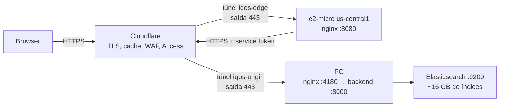

# Deploy do IQ OS — edge na Google Cloud (e2-micro, free tier) + origem local

Publica a plataforma na internet **sem mover os dados**: o edge na Google Cloud
serve a entrada pública e a stack pesada (Elasticsearch com ~16 GB de índices,
modelos, `data/` de 36 GB) continua na tua máquina.

## Topologia



- **A VM não guarda dados nem abre portas.** O `cloudflared` liga-se para fora,
  logo não há 80/443 na firewall e o IP da VM é descartável.
- **A origem não fica pública.** O hostname de origem está protegido por uma
  política *Service Auth* do Cloudflare Access: só o edge, com o service token,
  consegue falar com ela. Um browser que tente o URL recebe 403.
- **A página de manutenção é do edge.** Com o PC desligado, o visitante vê uma
  página do IQ OS (e não um `502` do Cloudflare) a tentar novamente.

## Custos reais (a parte honesta)

| Item | Free tier | Nesta montagem |
|---|---|---|
| VM e2-micro (us-central1/us-east1/us-west1) | 1 instância/mês | ✅ incluída |
| Disco de arranque | 30 GB-months pd-standard | ✅ 30 GB |
| Egress | 1 GB (Premium Tier) | ✅ 200 GiB/mês grátis, usando **Standard Tier** |
| **IP externo IPv4** | ❌ não incluído | ~$0.005/h ≈ **$3,65/mês** |

Ou seja: isto é "quase grátis", não grátis. O IP externo é cobrado desde 2024
mesmo em VMs do free tier. Para chegar a **$0** usa a [Variante 0](#variante-0--sem-vm).

Tudo o resto (Elasticsearch, modelos, ~36 GB de dados) fica no PC — que tem de
estar ligado para a plataforma responder.

## Limitações a saber antes

1. **Latência**: cada pedido vai ao edge nos EUA e volta para o PC em Portugal
   (~200–300 ms a mais que o acesso local). Aceitável para uso administrativo e
   demonstrações; não é ideal para o chat interativo.
2. **Páginas iframe** (`n8n`, dashboard do Hermes, SearXNG, MiroFish) apontam
   para `hostname:8891/8892/8888/8893`. Como o túnel só publica 80/443, essas
   páginas dão erro através do edge. Resolve-se com hostnames extra (ver
   [Iframes](#páginas-iframe-por-porta)).
3. **O PC tem de estar ligado.** É o preço de manter os 16 GB de índices locais.
4. **Egress**: a SPA e as respostas da API passam todas pela VM. 200 GiB chegam
   para uso normal, mas consultas pesadas de contratos (respostas de vários MB)
   contam. O Cloudflare cacheia os assets com hash no nome, o que alivia muito.
5. **A VM é o único ponto de entrada.** Free tier não tem SLA; para produção a
   sério, considera uma segunda VM noutra zona ou o cenário "VM paga".

## Passo a passo

### Fase 0 — Contas (manual, uma vez)

1. **Google Cloud**: criar conta + conta de **billing** em
   <https://console.cloud.google.com/billing>. O free tier exige billing ativo
   (não é preciso pagar nada para o e2-micro, mas o cartão é validado).
2. **Cloudflare**: domínio adicionado à conta (o túnel precisa de uma zona para
   criar os CNAMEs). O plano Free chega; o Access (Zero Trust) é grátis até 50
   utilizadores.

### Fase 1 — Túneis e DNS (no PC)

```powershell
cd c:\LLMFinance\finance-llm\deploy\gcp
.\01-setup-tunnels.ps1 -PublicHost iqos.teudominio.com -OriginHost iqos-origin.teudominio.com
```

Cria os dois túneis, os CNAMEs, escreve `origin/config.yml` e
`origin/edge-tunnel-info.txt`. No fim imprime o passo manual obrigatório:

- **Zero Trust → Access → Service Auth → Create Service Token** (`iqos-edge`):
  guardar Client ID (`<id>.access`) e Secret.
- **Zero Trust → Access → Applications → Self-hosted** para
  `iqos-origin.teudominio.com` com política **Service Auth** (só service tokens).
- Copiar os dois valores para `deploy/gcp/edge/edge.env`
  (modelo: `edge/edge.env.example`).

> Recomendado: pôr também uma Access application no hostname **público** com
> política de email (One-time PIN) — deixa de estar aberto a quem tenha o URL.

### Fase 2 — Provisionar a VM (Cloud Shell, sem instalar o gcloud)

1. Abrir <https://shell.cloud.google.com>.
2. Enviar a pasta `deploy/gcp` (⋮ → **Upload** → Folder). Inclui
   `origin/edge-tunnel-info.txt` e `edge/edge.env`.
3. Enviar também o ficheiro de credenciais do túnel do edge
   (`%USERPROFILE%\.cloudflared\<UUID>.json`, onde `<UUID>` é o do `iqos-edge`
   indicado no fim da Fase 1).
4. Correr:

```bash
bash 02-provision-vm.sh
```

Cria projeto (se não existir), liga o billing, ativa o Compute, cria a firewall
(SSH só via IAP), a VM e2-micro em Standard Tier com Debian 12, 30 GB,
**swap de 1 GB**, Docker e cloudflared. É idempotente.

> `PROJECT_ID` é único a nível mundial: se o nome estiver ocupado, usa
> `PROJECT_ID=iqos-edge-2711 bash 02-provision-vm.sh`.

### Fase 3 — Configurar o edge na VM (Cloud Shell)

```bash
bash 03-configure-edge.sh
```

Envia `compose.yml`/`edge.env`/`templates` (com conversão CRLF→LF, porque vêm do
Windows), valida a config do túnel (`cloudflared tunnel ingress validate`),
instala o serviço, arranca o nginx e verifica `127.0.0.1:8080/healthz`.

### Fase 4 — Origem a correr (no PC)

```powershell
# stack local (Elasticsearch + backend + frontend)
cd c:\LLMFinance\finance-llm
docker compose up -d

# túnel de origem
cd deploy\gcp
.\04-start-origin.ps1
```

Para deixar permanente, `.\04-start-origin.ps1 -AsService` imprime os comandos
(serviço do Windows ou tarefa agendada no login).

### Fase 5 — Validar

```powershell
.\05-verify.ps1 -PublicHost iqos.teudominio.com -OriginHost iqos-origin.teudominio.com
```

Verifica: stack local (200), origem sem credenciais (tem de dar **403**), SPA e
API pelo edge (200). Se a origem devolver 200 anónimo, pára: está pública.

## Troubleshooting

| Sintoma | Causa provável | Verificação |
|---|---|---|
| 502/503 no hostname público | túnel de origem em baixo, ou stack local desligada | `.\04-start-origin.ps1`; `docker compose ps` |
| Página “origem indisponível” (do edge) | mesmo caso, mas o edge está bem | `sudo docker compose -f /opt/iqos-edge/compose.yml ps` na VM |
| 403 no hostname público | Access a bloquear-te | a política de email existe e o teu login está incluído? |
| 1016 / DNS não resolve | CNAME ainda a propagar, ou zona errada | `cloudflared tunnel route dns --overwrite-dns iqos-edge host` |
| Container do edge em restart | `edge.env` com placeholder ou service token inválido | `sudo docker compose logs edge` |
| Moji-bake / variáveis inválidas | ficheiros CRLF vindos do Windows | já tratado no `03`; confirma com `file edge/edge.env` |
| `cloudflared` na VM não arranca | credenciais erradas para o UUID | `sudo journalctl -u cloudflared -n 50` |

Smoke test rápido sem domínio (na VM): `cloudflared tunnel --url http://127.0.0.1:8080`
dá um URL `*.trycloudflare.com` temporário — útil para confirmar o nginx antes
de mexer em DNS.

## Páginas iframe (por porta)

As páginas iframe usam `window.location.hostname` + porta. Só 80/443 atravessam
o túnel, por isso `n8n`, dashboard do Hermes, SearXNG e MiroFish não funcionam
pelo edge tal como estão. Duas opções:

1. **Hostnames extra** (`n8n.teudominio.com` → CNAME do túnel do edge) +
   `location /` no template a apontar para `https://${ORIGIN_HOSTNAME}` com o
   porto da app — requer também rotas extra no túnel de origem.
2. **Abrir esses painéis localmente** (são ferramentas de administração) e deixar
   pelo edge apenas a plataforma IQ OS.

## Link imediato, sem domínio (e PC sem hibernar)

O `public-link.ps1` publica a stack local num URL Cloudflare em segundos — sem
domínio nem conta Cloudflare — e impede o PC de suspender/hibernar enquanto o
link estiver vivo.

```powershell
cd c:\LLMFinance\finance-llm\deploy\gcp
.\public-link.ps1                                    # link novo https://<aleatorio>.trycloudflare.com
.\public-link.ps1 -SetPowerTimeouts                  # + timeouts de energia persistentes a "nunca"
.\public-link.ps1 -ConfigPath .\origin\config.yml    # link fixo do teu domínio (com Access)
.\public-link.ps1 -Stop                              # parar e libertar o bloqueio
```

Como funciona:

- O `cloudflared` corre num **processo destacado** (PIDs em `public-link.pid`),
  por isso continua a servir depois de fechares o terminal.
- O mesmo processo chama `SetThreadExecutionState(ES_CONTINUOUS | ES_SYSTEM_REQUIRED)`
  a cada 20 s: o bloqueio de suspensão existe **só enquanto o túnel viver** e é
  libertado no `-Stop`. Não deixa a máquina condenada a nunca dormir.
- Com `-SetPowerTimeouts` os timeouts do plano de energia ficam a zero
  (`standby-timeout-ac/dc` e `hibernate-timeout-ac/dc`). Neste PC o standby
  estava a **5 minutos** — era isso que punha a máquina a dormir.
- O ecrã pode apagar-se à vontade; o que não acontece é a suspensão.

Limites do quick tunnel: não tem Cloudflare Access (quem tiver o URL chega à
plataforma — o login da app continua a ser pedido), o URL **muda a cada
arranque** e é um recurso pensado para teste. Para link fixo e protegido, usa o
túnel nomeado (`01-setup-tunnels.ps1` + `-ConfigPath`).

## Variante 0 — sem VM (é o caminho mais rápido e 100% grátis)

Se aceitares expor o PC diretamente pelo Cloudflare, não precisas de VM nenhuma:

```powershell
cloudflared tunnel --config deploy\gcp\origin\config.yml run
```

com o hostname do túnel de origem a apontar para a SPA (`http://127.0.0.1:4180`).
Ganha-se: **$0**, menos um salto (latência metade), sem egress do GCP, sem
provisionamento. Perde-se: um único ponto de entrada, o `config.yml` local passa
a ser a superfície pública (mitigável com Access), e o PC tem de estar ligado na
mesma.

Vale a pena a VM quando quiseres um ponto de entrada sempre disponível, com
página de manutenção própria e a origem escondida por trás de um service token.

## Manutenção

```powershell
# atualizar o edge depois de mudar edge.env ou o template do nginx
bash 03-configure-edge.sh    # (no Cloud Shell; é idempotente)

# logs
gcloud compute ssh iqos-edge --zone us-central1-a --tunnel-through-iap --command "sudo docker compose -f /opt/iqos-edge/compose.yml logs -n 100"
sudo journalctl -u cloudflared -n 100

# parar tudo e poupar o IP (o IP efémero deixa de ser cobrado quando a VM pára)
gcloud compute instances stop iqos-edge --zone us-central1-a
```

## Ficheiros

| Ficheiro | Onde corre | Para quê |
|---|---|---|
| `01-setup-tunnels.ps1` | PC | cria túneis, DNS e a config da origem |
| `02-provision-vm.sh` | Cloud Shell | projeto, billing, firewall, VM e2-micro |
| `03-configure-edge.sh` | Cloud Shell | põe o edge na VM (nginx + cloudflared) |
| `04-start-origin.ps1` | PC | publica a stack local no túnel de origem |
| `05-verify.ps1` | PC | verificação ponta-a-ponta |
| `public-link.ps1` | PC | link Cloudflare imediato + PC acordado (ver abaixo) |
| `edge/compose.yml`, `edge/templates/default.conf.template`, `edge/offline.html` | VM | o edge em si |
| `origin/config.yml` | PC | gerado pelo `01` (não versionado) |
