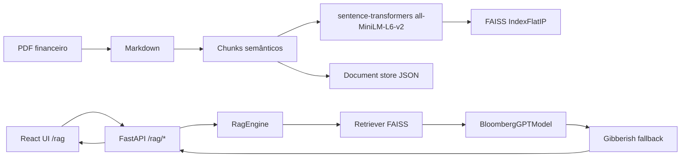

# Arquitetura BloombergGPT + RAG — Finance-LLM

## Visão geral

O sistema adiciona uma camada **RAG (Retrieval-Augmented Generation)** ao Finance-LLM, permitindo ingerir PDFs financeiros, convertê-los para Markdown, fragmentá-los em chunks, indexá-los vetorialmente com FAISS e responder perguntas com base exclusiva nos documentos carregados. O modelo gerador é um **BloombergGPT-style** (wrapping de um CausalLM baseado em Mistral, treinado com dados financeiros) com fallback robusto para texto recuperado quando a geração é token-salad.

## Componentes principais



## 1. Ingestão de PDFs → Markdown

- **Ficheiro**: [`rag/ingestion/pdf_to_markdown.py`](../rag/ingestion/pdf_to_markdown.py)
- Bibliotecas: PyMuPDF (`fitz`), `markdown`
- Cada PDF é convertido num ficheiro `.md` em `rag_data/markdown/` com metadados:
  - `id` (hash SHA-256 curto)
  - `title` (nome do ficheiro sem `.pdf`)
  - `pages`, `size_bytes`, `hash`, `md_path`

## 2. Chunking

- **Ficheiro**: [`rag/ingestion/chunker.py`](../rag/ingestion/chunker.py)
- Estratégia:
  - Particiona por cabeçalhos Markdown (#, ##, ###)
  - Garante `chunk_id` único por documento
  - Preserva `doc_id`, `doc_title`, `page`
- Ficheiros de chunks persistidos em JSONL junto ao Markdown.

## 3. Armazenamento

- **Document store**: [`rag/storage/document_store.py`](../rag/storage/document_store.py)
  - Persistência JSON em `rag_data/documents.json`
  - Operações: add, get, delete, list, set_indexed, exists (por hash)
- **Vector store**: [`rag/storage/vector_store.py`](../rag/storage/vector_store.py)
  - FAISS `IndexFlatIP` em `rag_data/vector.index`
  - Mapeamento `id_map.json` para chunk_id/doc_id/texto
  - Normalização L2 dos embeddings → distância de cosseno via produto interno

## 4. Modelo gerador — BloombergGPT-style

- **Wrapper**: [`rag/models/bloomberg_gpt.py`](../rag/models/bloomberg_gpt.py)
- Carrega qualquer `AutoModelForCausalLM` a partir de checkpoint local.
- Demo treinado e guardado em [`model/bloomberg-finance/final`](../model/bloomberg-finance/final).
- Métodos: `predict()` e `predict_streaming()`
- Prompt por defeito em português, instruindo a responder só com base nas fontes.

### Fallback anti-gibberish

- Localização: [`rag/chat/rag_engine.py`](../rag/chat/rag_engine.py), método `_looks_like_gibberish()`
- Heurísticas:
  - curto (< 20 palavras) e sem pontuação → gibberish
  - < 10% stopwords em português → gibberish
  - < 20% de palavras saudáveis (≥3 letras alfabéticas) → gibberish
  - > 45% de tokens numéricos/hifenados → gibberish
- Se detetado, a resposta final é um snippet das sources recuperadas.

## 5. API FastAPI

- **Raiz**: [`api/main.py`](../api/main.py)
- **Rotas RAG**: [`api/rag_routes.py`](../api/rag_routes.py)
  - `POST /rag/upload` — upload de PDF, conversão, chunking, indexação
  - `GET /rag/documents` — listar documentos
  - `DELETE /rag/documents/{doc_id}` — apagar documento, chunks e embeddings
  - `POST /rag/chat` — resposta síncrona com `answer`, `sources`, `model_used`
  - `POST /rag/chat/stream` — SSE com sources seguidas de tokens
  - `POST /rag/explain` — explicação da resposta RAG
- **Serviço singleton**: [`api/rag_service.py`](../api/rag_service.py)
  - Cache do `RagEngine`, logging em `rag_service.log`
  - Fallback de modelo: `bloomberg-finance/final` → `mistral-finance/final` → `gpt2-finance/final`

## 6. Frontend React

- **Página**: [`chat-ui/src/pages/RagPage.tsx`](../chat-ui/src/pages/RagPage.tsx)
- **Componentes**:
  - [`PdfUploader.tsx`](../chat-ui/src/components/PdfUploader.tsx)
  - [`RagChat.tsx`](../chat-ui/src/components/RagChat.tsx)
  - [`Sidebar.tsx`](../chat-ui/src/components/Sidebar.tsx) mostra documentos indexados
- **API client**: [`chat-ui/src/api.ts`](../chat-ui/src/api.ts)
  - Base URL padrão: `http://127.0.0.1:8003`
- **Navegação**: botão "RAG" no [`App.tsx`](../chat-ui/src/App.tsx)
- Estilo: Tailwind CSS v4, layout full-height, chat com scroll automático.

## 7. Treino do BloombergGPT-style

- **Script demo**: [`scripts/train_bloomberg.py`](../scripts/train_bloomberg.py)
- **Modelo treinável**: [`rag/models/train_bloomberg.py`](../rag/models/train_bloomberg.py)
- Características:
  - Base Mistral-7B carregada em 4-bit (para demo treinou apenas embedding + LM head)
  - Dataset financeiro do corpus construído pelo `processing/build_corpus.py`
  - Resultado demo: train_loss 3.473, eval_loss 3.389
- O modelo final fica em `model/bloomberg-finance/final`.

## Fluxo típico

1. Utilizador faz upload de um PDF financeiro na UI `/rag`.
2. Backend converte PDF → Markdown → chunks → embeddings FAISS.
3. Documento aparece na sidebar.
4. Utilizador pergunta, por exemplo: *"Quanto faturou a Apple em 2024?"*
5. RagEngine recupera os top-k chunks mais relevantes.
6. BloombergGPT-style gera uma resposta.
7. Se a geração for token-salad, o fallback devolve a fonte recuperada.
8. UI mostra resposta + fontes numeradas.

## Portas e execução

- Backend: `127.0.0.1:8003` (anteriormente 8002, mudado por conflito com ghost process)
- Frontend dev: `127.0.0.1:5173`
- Comandos:

```powershell
# Backend
cd c:\LLMFinance\finance-llm
.\.venv\Scripts\python.exe -m uvicorn api.main:app --host 127.0.0.1 --port 8003 --reload

# Frontend
cd chat-ui
npm run dev
```

## Estrutura de ficheiros

```
finance-llm/
├── api/
│   ├── main.py
│   ├── models.py
│   ├── rag_routes.py
│   └── rag_service.py
├── rag/
│   ├── chat/
│   │   ├── rag_engine.py
│   │   └── explain_predictions.py
│   ├── ingestion/
│   │   ├── pdf_to_markdown.py
│   │   └── chunker.py
│   ├── models/
│   │   ├── bloomberg_gpt.py
│   │   └── train_bloomberg.py
│   ├── storage/
│   │   ├── document_store.py
│   │   └── vector_store.py
│   └── paths.py
├── chat-ui/src/
│   ├── pages/RagPage.tsx
│   ├── components/PdfUploader.tsx
│   ├── components/RagChat.tsx
│   └── api.ts
├── model/bloomberg-finance/final
├── docs/bloomberggpt_rag_architecture.md
└── rag_data/
    ├── markdown/
    ├── documents.json
    └── vector.index
```

## Resultado validado

Pergunta testada: *"Quanto faturou a Apple em 2024?"*

Resposta fallback: *"Com base no documento carregado: Página 1 Relatório Financeiro Demo A Apple Inc reportou receitas de 383 biliões de dólares em 2024."*

Modelo usado: `model/bloomberg-finance/final`

Fonte: chunk `ff6d7ca7fe07f191_000001` (score ≈ 0.61).


